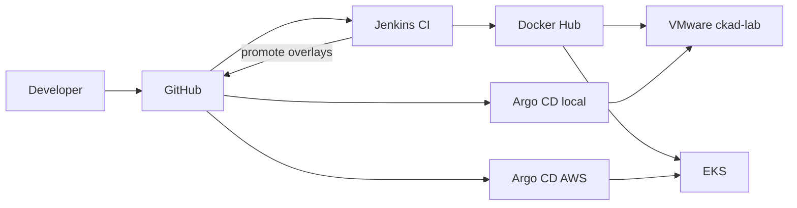

# Kubernetes Platform Engineering & GitOps Lab

A portfolio project that builds a small platform around a containerized application: Kubernetes delivery, infrastructure as code, CI, GitOps CD, an AWS deployment path, networking, observability, and Python automation.

## Project objective

Show how a platform engineer takes an application from source to a running Kubernetes workload, with a repeatable local lab and a separate AWS target. Each layer is added only after the previous one is documented and working.

The FastAPI application lives under `app/`, and its container image is published on Docker Hub as `kirandevraaj/platform-lab:0.1.3`. Jenkins CI on Docker Desktop polls GitHub, publishes versioned images when `app/**` changes, and promotes the image tag into **both** GitOps overlays (`local` and `aws`). It does not deploy. Argo CD reconciles each overlay onto its target cluster (VMware and EKS). Observability (Prometheus + Grafana) is GitOps-managed on the local lab in namespace `monitoring`.

## Architecture overview

```text
Developer
   |
   v
GitHub
   |
   +--> Jenkins CI (pollSCM, app/** gated)
   |         → unit tests → Docker build → Docker Hub
   |         → GitOps promote (local + aws overlays)
   |
   +--> Argo CD / GitOps
            ├── platform-lab-local → VMware (ckad-lab)
            └── platform-lab-aws   → EKS (platform-lab-aws-lab-eks)

Jenkins performs CI and GitOps promotion.
Argo CD performs Kubernetes deployment and reconciliation.
```


Local runtime observed on 24 September 2026 (read-only):

| Node | Role | Address | OS | Kubernetes | Runtime |
|---|---|---|---|---|---|
| k8s-ctrl-01 | control-plane | 192.168.56.10 | Ubuntu 24.04.4 LTS | v1.31.14 | containerd 2.2.1 |
| k8s-worker-01 | worker | 192.168.56.11 | Ubuntu 24.04.4 LTS | v1.31.14 | containerd 2.2.1 |
| k8s-worker-02 | worker | 192.168.56.12 | Ubuntu 24.04.4 LTS | v1.31.14 | containerd 2.2.1 |

Platform components already running in the local cluster: Calico v3.30.7 (CNI), CoreDNS, kube-proxy, metrics-server, ingress-nginx (MetalLB LoadBalancer on the local overlay), MetalLB L2 pool `lab-pool`, and the local-path provisioner. The application workload `platform-lab` is deployed in namespace `platform-lab` from `kubernetes/overlays/local`: two replicas of `kirandevraaj/platform-lab:0.1.2` and a ClusterIP Service on port 8000. External HTTP uses Host `platform-lab.local` via the MetalLB VIP. The AWS overlay is not applied.

## Technology stack

Present in the local lab now:

| Area | What is there |
|---|---|
| Local infrastructure | VMware Workstation Pro on Windows 11 |
| Node OS | Ubuntu 24.04.4 LTS |
| Orchestration | Kubernetes v1.31.14 |
| Node runtime | containerd 2.2.1 |
| Networking | Calico v3.30.7, ingress-nginx, MetalLB |
| Application | Python FastAPI service under `app/`, version 0.1.2 (0.1.3 adds `/metrics`), running in namespace `platform-lab` on the local cluster |
| Published image | `kirandevraaj/platform-lab:0.1.2` on Docker Hub (0.1.3 via Jenkins after this change) |
| Observability | kube-prometheus-stack via Argo CD (`monitoring`); Grafana LoadBalancer; Prometheus ClusterIP |

Planned, and not in this repository yet:

| Area | Tool |
|---|---|
| OpenTelemetry | Application tracing (later) |
| AWS path | Terraform |

The Jenkins controller and Linux agent run on Docker Desktop (http://127.0.0.1:8080). Job `platform-lab-ci` uses credential `dockerhub-platform-lab` and publishes `kirandevraaj/platform-lab:<APP_VERSION>`. It does not deploy to Kubernetes.

Docker Desktop client 29.6.1 builds the local image. It is not the cluster runtime. Terraform is not installed.

## Environment strategy

Two deployment targets stay separate for the life of this project.

| Target | Purpose | How it is reached |
|---|---|---|
| Local lab | Day-to-day platform work on the three VMware nodes | SSH and kubectl against `192.168.56.0/24` |
| AWS | EKS lab (`platform-lab-aws-lab-eks`) via Terraform + `kubernetes/overlays/aws` | AWS credentials and kube context `platform-lab-aws` |

When those overlays exist, they will describe the same application shape with different infrastructure. A change for one target stays in that target. See [environment strategy](docs/design/environment-strategy.md).

## Implementation status

1. **Repository baseline.** Completed. Project layout, architecture notes, and a read-only record of the current lab.
2. **Application and container image.** Completed. The service, tests, and Dockerfile are in `app/`. Current published tag is `kirandevraaj/platform-lab:0.1.2`. The tag `latest` is not used.
3. **Kubernetes packaging.** Completed. Initially applied on 24 September 2026 with `kubectl apply -k kubernetes/overlays/local`. Ongoing changes are GitOps-only through Argo CD. The AWS overlay has not been applied.
4. **Jenkins CI pipeline definition.** Completed. `jenkins/Jenkinsfile` checks out the repository, tests `app/tests`, reads `APP_VERSION`, builds and validates `kirandevraaj/platform-lab:<APP_VERSION>`, and pushes that tag. See [jenkins/README.md](jenkins/README.md).
5. **Jenkins execution and publishing.** Completed. Job `platform-lab-ci` publishes versioned tags with credential `dockerhub-platform-lab`. Image validation reaches the temporary container over the agent Docker network. No `latest` tag. No Kubernetes deploy from CI.
6. **Argo CD GitOps.** Completed. Argo CD `v3.5.3` is installed in namespace `argocd` on `ckad-lab`. Application `platform-lab-local` watches `kubernetes/overlays/local` on `main` and syncs to namespace `platform-lab` on the in-cluster API. Automated sync, prune, and selfHeal are enabled. See [gitops/README.md](gitops/README.md) and [docs/architecture/gitops-flow.md](docs/architecture/gitops-flow.md).
7. **Manual CI/CD integration test (0.1.1).** Completed on 24 September 2026. Release `0.1.1` was pushed to GitHub; Jenkins built and published `kirandevraaj/platform-lab:0.1.1`; the local overlay was updated to that tag and pushed; Argo CD reconciled without `kubectl apply`; both pods ran `0.1.1`; `GET /` returned version `0.1.1`, environment `local-gitops`, and release `ci-cd-integration-test`. See [docs/architecture/ci-cd-flow.md](docs/architecture/ci-cd-flow.md).
8. **Automated CI/CD promotion.** Completed and extended for multi-environment GitOps. `jenkins/Jenkinsfile` uses `pollSCM`, runs build/push/promotion only for `app/**` changes, refuses reused Docker Hub tags, updates **both** `kubernetes/overlays/local` and `kubernetes/overlays/aws` image tags, and pushes with `github-platform-lab`. Loop prevention skips rebuild on GitOps-only commits. First dual-environment release demo is reserved for `0.1.4`. See [jenkins/README.md](jenkins/README.md) and [docs/architecture/ci-cd-flow.md](docs/architecture/ci-cd-flow.md).
9. **Networking.** Completed for the local lab. Ingress + NetworkPolicy in `kubernetes/base`; local overlay patches `ingress-nginx-controller` to MetalLB **LoadBalancer** (L2). Application Service stays ClusterIP. See [docs/architecture/networking.md](docs/architecture/networking.md).
10. **Observability.** Completed for the local lab on 24 September 2026. `kube-prometheus-stack` is managed by Argo CD Application `platform-lab-observability`. Grafana is MetalLB LoadBalancer (observed VIP `192.168.56.201`); Prometheus is ClusterIP. Application exposes `/metrics` from version `0.1.3`. ServiceMonitor targets are up. See [docs/architecture/observability.md](docs/architecture/observability.md).
11. **Reliability & production hardening.** Completed for the local lab. Local overlay adds HPA (CPU 70%, 2–4 replicas), PDB (`minAvailable: 1`), RollingUpdate `maxUnavailable: 0` / `maxSurge: 1`, and soft hostname topology spread. See [docs/architecture/reliability.md](docs/architecture/reliability.md).
12. **AWS path.** Provisioned and validated: EKS 1.36, AWS Load Balancer Controller, Argo CD, Application `platform-lab-aws` watching `kubernetes/overlays/aws`. VMware lab remains independent.
13. **Python automation.** Planned. Repeatable checks and operational helpers.

### Project 1 — AWS storage (complete)

20. **AWS EBS-backed persistent storage** ✅ — EBS CSI add-on + Pod Identity, `ebs-gp3`, StatefulSet `storage-demo`, Pod-delete persistence. See [`docs/aws-storage-statefulset.md`](docs/aws-storage-statefulset.md).
21. **AWS node/AZ storage resilience** ✅ — controlled worker terminate, same-AZ EBS reattach, data preservation, AZ topology Pending demo, temporary same-AZ node group cleaned up. See [`docs/aws-storage-resilience.md`](docs/aws-storage-resilience.md).
22. **Security / RBAC hardening** ✅ — isolated `security-lab` on VMware + AWS, least-privilege Roles/Bindings, PSA baseline, NetworkPolicy lab, platform-lab SA token disable. See [`docs/security-rbac.md`](docs/security-rbac.md).

Demonstrated (observed, not claimed beyond evidence): same-AZ worker replacement · EBS CSI reattachment · data preservation · AZ topology restriction. **Not** multi-AZ EBS storage.

## Published container artifact

Version `0.1.3` is the current published image used by the local lab. The tag `latest` is intentionally unused. The digest is the immutable reference for that artifact.

| Field | Value |
|---|---|
| Image | `kirandevraaj/platform-lab:0.1.3` |
| Docker Hub | https://hub.docker.com/r/kirandevraaj/platform-lab |
| Digest | `sha256:b2c2d0d5617c05e2fb36ab186e6ebd8bbd1de7c10a928ade922337f7df18f6ba` |

```text
docker pull kirandevraaj/platform-lab:0.1.3
docker pull kirandevraaj/platform-lab@sha256:b2c2d0d5617c05e2fb36ab186e6ebd8bbd1de7c10a928ade922337f7df18f6ba
```
## Safety note

The local VMware lab and the AWS account are separate deployment targets. Commands, kube contexts, Terraform workspaces, and GitOps applications for one target must not be aimed at the other. Cluster, VM, and network changes wait for explicit approval.

## Layout

```text
kubernetes-platform-engineering-gitops/
├── README.md
├── LICENSE
├── .gitignore
├── docs/
│   ├── architecture/
│   ├── design/
│   └── troubleshooting/
├── app/
│   ├── src/
│   └── tests/
├── kubernetes/
│   ├── base/
│   └── overlays/
│       ├── local/
│       └── aws/
├── gitops/
│   ├── applications/
│   ├── projects/
│   └── appsets/
├── jenkins/
│   ├── Jenkinsfile
│   ├── README.md
│   └── runtime/
│       ├── compose.yaml
│       ├── controller/
│       └── agent/
├── terraform/
│   └── aws/
└── scripts/
```

## License

MIT. See [LICENSE](LICENSE).
