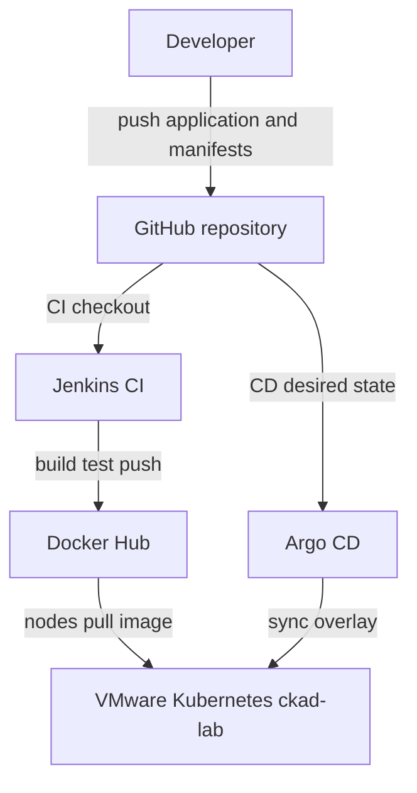
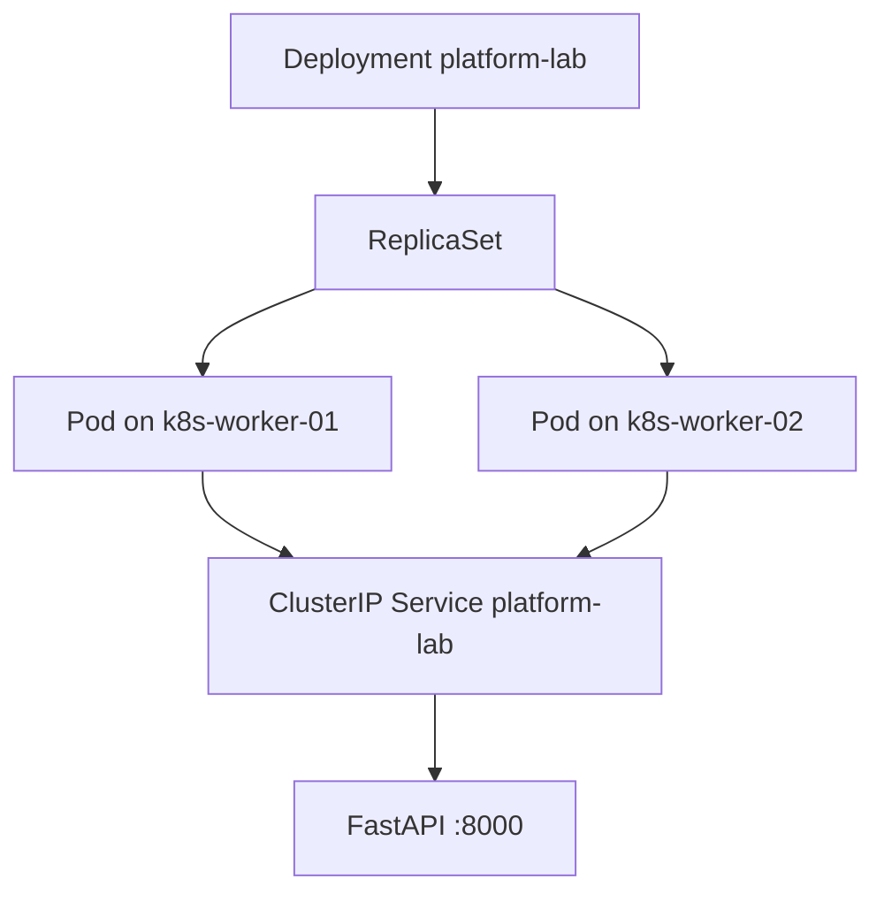

# Architecture overview

Status: baseline. This document records the lab as observed and the platform shape we intend to build. It does not authorize changes.

## Current local runtime

Three Ubuntu 24.04.4 LTS virtual machines on VMware Workstation Pro, on host-only network `192.168.56.0/24`. This is the current development environment:

| Node | Role | Address |
|---|---|---|
| k8s-ctrl-01 | control-plane | 192.168.56.10 |
| k8s-worker-01 | worker | 192.168.56.11 |
| k8s-worker-02 | worker | 192.168.56.12 |

Kubernetes v1.31.14. Container runtime is containerd 2.2.1. Control-plane components run as static pods on `k8s-ctrl-01` (`etcd`, `kube-apiserver`, `kube-controller-manager`, `kube-scheduler`).

## Cluster platform already present

| Concern | Component |
|---|---|
| CNI | Calico v3.30.7, installed with the Tigera operator (`calico-system`, `calico-apiserver`, `tigera-operator`) |
| DNS | CoreDNS |
| Node proxy | kube-proxy |
| Metrics | metrics-server |
| Ingress | ingress-nginx, Service type NodePort `80:30080` and `443:30443` |
| Load balancer addresses | MetalLB (`controller` plus `speaker` on each node) |
| Storage | local-path provisioner (`local-path-storage`) |

Namespace `platform-lab` holds the application deployed from `kubernetes/overlays/local` on 24 September 2026. Other namespaces in use: `calico-apiserver`, `calico-system`, `default`, `ingress-nginx`, `kube-node-lease`, `kube-public`, `kube-system`, `local-path-storage`, `metallb-system`, `tigera-operator`.

## Planned platform shape

The repository holds the application source under `app/`, including a Dockerfile for a local image. It is packaged once for two overlays:

- `kubernetes/overlays/local` for this VMware cluster (applied)
- `kubernetes/overlays/aws` for a later AWS cluster (not applied)

The local overlay is running on this cluster. The AWS overlay has not been applied. The published image used by the local lab is `kirandevraaj/platform-lab:0.1.1`. Jenkins CI on Docker Desktop runs `jenkins/Jenkinsfile` on node `linux-agent`: it polls GitHub, publishes images when `app/**` changes, and commits the local overlay image tag; it does not deploy to this cluster. Argo CD `v3.5.3` runs in namespace `argocd` on `ckad-lab` and reconciles Application `platform-lab-local` from `kubernetes/overlays/local` on `main`. Prometheus, Grafana, and OpenTelemetry are planned to observe the application. Terraform under `terraform/aws` is reserved for the AWS path and does not describe this VMware lab. AWS is a separate future deployment target.

## Delivery flow

Jenkins is CI only. Argo CD is CD only. Docker Desktop Kubernetes is not a deployment target.

## Kubernetes packaging

Kustomize keeps one shared description of the workload and small differences per target. On 24 September 2026, `kubectl apply -k kubernetes/overlays/local` created the objects below on this cluster. The AWS overlay remains files in Git only.

`kubernetes/base` holds the objects that both targets share:

| Object | Name | Role |
|---|---|---|
| Namespace | `platform-lab` | Isolates the workload |
| ConfigMap | `platform-lab-config` | Supplies `APP_ENVIRONMENT` |
| Deployment | `platform-lab` | Runs two replicas; base defaults to `kirandevraaj/platform-lab:0.1.0` |
| Service | `platform-lab` | ClusterIP on port 8000 |

`kubernetes/overlays/local` points at that base, keeps `APP_ENVIRONMENT=local-gitops`, and uses a Kustomize `images` entry so the Deployment resolves to `kirandevraaj/platform-lab:0.1.1`. `kubernetes/overlays/aws` also points at the base and still resolves to `0.1.0`. It does not add AWS resources yet.

## Actual local deployment

First applied on 24 September 2026 with `kubectl apply -k kubernetes/overlays/local` on context `ckad-lab`. After the GitOps promotion of `0.1.1`, Argo CD owns ongoing reconciliation. Pod names change across rollouts.

| Object | Observed value after 0.1.1 GitOps promotion |
|---|---|
| Namespace | `platform-lab` |
| Deployment | `platform-lab`, 2 replicas, Ready |
| Service | `platform-lab`, ClusterIP, port 8000 |
| Image | `kirandevraaj/platform-lab:0.1.1` |
| ConfigMap `APP_ENVIRONMENT` | `local-gitops` |
| `GET /` | version `0.1.1`, environment `local-gitops`, release `ci-cd-integration-test` |

The Service is ClusterIP only. Ingress and MetalLB are not used for this workload.

## Windows workstation

The workstation reaches the nodes with OpenSSH (`k8s-ctrl-01`, `k8s-worker-01`, `k8s-worker-02` in the user SSH config). A local kubectl context named `ckad-lab` is present. Docker Desktop client 29.6.1 is installed; the engine was not running at assessment time. Terraform is not on `PATH`.
