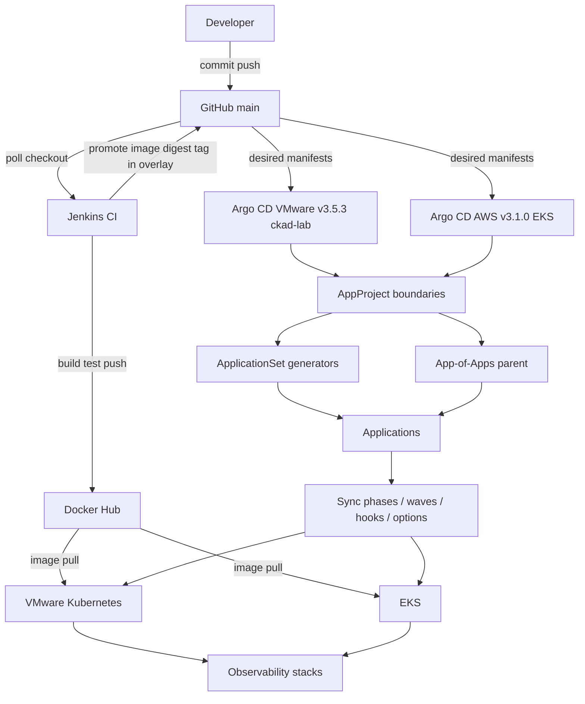

# Argo CD GitOps Reference Architecture (Project 1)

**Status:** Advanced patterns milestone (Section 23) — production-like Applications unchanged; learning control plane added on VMware (`ckad-lab`, Argo CD v3.5.3) with a separate AWS instance (EKS, v3.1.0, context via `platform-aws-tools`).

**Repository:** `https://github.com/kirandevraaj/kubernetes-platform-engineering-gitops.git`

---

## Composition: Developer → GitHub → Jenkins / Argo CD

Git holds **Kubernetes desired state**. Jenkins holds **artifact production**. Argo CD holds **cluster reconciliation**. Each role is narrow; overlap causes drift and blind spots.



ASCII equivalent:

```text
Developer
    |
    v
 GitHub (source of truth for manifests + promoted image refs)
    |
    +------------------------+------------------------+
    |                        |                        |
 Jenkins CI              Argo CD (VMware)         Argo CD (AWS)
    |                        |                        |
 Docker Hub              AppProject(s)            AppProject(s)
    |                        |                        |
    |                 +------+------+          (same pattern)
    |                 |             |
    |          ApplicationSet   App-of-Apps
    |                 |             |
    |            Applications   Child Applications
    |                 |             |
    |                 +------+------+
    |                        |
    |              Sync lifecycle
    |              (hooks, waves, options)
    |                        |
    +------------------------+------------------------+
                             |
                    Kubernetes (VMware / EKS)
                             |
                    Observability (existing apps)
```

**Diagram assets:** [argo-enterprise-gitops-composition.svg](../diagrams/argo-enterprise-gitops-composition.svg) · [argo-advanced-gitops-reference.svg](../diagrams/argo-advanced-gitops-reference.svg)

---

## Role boundaries

| Role | System | Responsibility | Does not |
|------|--------|----------------|----------|
| **Source of truth** | Git (`main`) | Declarative desired state: Kustomize overlays, Helm values, Argo Application/ApplicationSet YAML | Run workloads |
| **CI** | Jenkins | Test app code, build/push `kirandevraaj/platform-lab`, commit overlay promotion (digest/tag) | `kubectl apply`, deploy to cluster |
| **Artifact registry** | Docker Hub | Immutable images consumed by Deployments | Define K8s manifests |
| **CD / reconcile** | Argo CD | Diff Git vs live, sync, prune, self-heal, hooks/waves | Build images or mutate Git without a commit |
| **Policy** | AppProject | Allow listed repos → destinations → resource kinds; sync windows; project roles | Replace Kubernetes RBAC for pods |
| **Scale-out GitOps** | ApplicationSet | Generate Applications from list/Git/cluster parameters | Replace need for per-env Application review |
| **Composition** | App-of-Apps / App-of-ApplicationSets | Parent Application installs child Application or ApplicationSet manifests | Automatically secure children (still need AppProject) |
| **Runtime** | Kubernetes | Run pods, storage, ingress, observability | Author GitOps objects |

---

## Two Argo CD instances (no shared cluster registry)

| Environment | Context | Argo CD image | In-cluster only |
|-------------|---------|---------------|-----------------|
| VMware lab | `ckad-lab` | `quay.io/argoproj/argocd:v3.5.3` | Yes — destination `https://kubernetes.default.svc` |
| AWS lab | EKS (tools context `platform-aws-tools`) | `quay.io/argoproj/argocd:v3.1.0` | Yes — same default API pattern |

**Before this milestone:** no ApplicationSets; no remote cluster Secrets on either instance. Multi-cluster **cluster generator** demos use a **label-selected in-cluster Secret** on VMware only (`platform-advanced-cluster-set`), not cross-registration of EKS on VMware Argo or vice versa.

---

## Application inventory (unchanged production-like)

### VMware (`ckad-lab`)

| Application | Project | Source path | Destination NS | Sync | Prune | SelfHeal | Sync options |
|-------------|---------|-------------|----------------|------|-------|----------|--------------|
| platform-lab-local | platform-lab | kubernetes/overlays/local | platform-lab | automated | true | true | CreateNamespace=true, ApplyOutOfSyncOnly=true |
| platform-lab-observability | platform-lab-observability | Helm + git (monitoring stack) | monitoring | automated | true | true | CreateNamespace=true, ServerSideApply=true, ApplyOutOfSyncOnly=true |
| platform-security-vmware | platform-security-vmware | kubernetes/security-lab-vmware | security-lab | automated | true | true | CreateNamespace=true, ApplyOutOfSyncOnly=true |
| platform-storage-vmware | platform-storage-vmware | kubernetes/storage-lab | storage-lab | automated | true | true | CreateNamespace=true, ApplyOutOfSyncOnly=true |

### AWS (EKS)

| Application | Project | Source path | Destination NS | Sync | Prune | SelfHeal | Sync options |
|-------------|---------|-------------|----------------|------|-------|----------|--------------|
| platform-lab-aws | platform-lab-aws | kubernetes/overlays/aws | platform-lab | automated | true | true | CreateNamespace=true, ApplyOutOfSyncOnly=true |
| platform-storage-aws | platform-storage-aws | kubernetes/storage-lab-aws | storage-lab | automated | true | true | CreateNamespace=true, ApplyOutOfSyncOnly=true |
| platform-security-aws | platform-security-aws | kubernetes/security-lab-aws | security-lab | automated | true | true | CreateNamespace=true, ApplyOutOfSyncOnly=true |
| platform-observability-aws | platform-observability-aws | Helm charts | observability | automated | true | true | CreateNamespace=true, ServerSideApply=true, ApplyOutOfSyncOnly=true |
| platform-k8s-metrics-aws | platform-k8s-metrics-aws | Helm | observability | automated | true | true | CreateNamespace=true, ServerSideApply=true, ApplyOutOfSyncOnly=true |

**Platform app image (unchanged):** `kirandevraaj/platform-lab:0.1.4` · digest `sha256:1cca2b5964043fe6c9c09f17d7f86a3572a46699602919d15c45c9a069b872ff`

---

## Advanced lab control plane (VMware)

| Object | Purpose |
|--------|---------|
| AppProject `platform-advanced-lab` | Restricted sources/destinations/kinds for learning only |
| Application `platform-argo-advanced-lab` | Sync waves, hooks, combined lab under `kubernetes/argo-advanced-lab/combined` → `argo-advanced-lab` |
| Application `platform-app-of-apps` | Children in `kubernetes/argo-app-of-apps/children` → `argocd` |
| Application `platform-app-of-applicationsets` | Nested set in `kubernetes/argo-app-of-applicationsets` → `argocd` |
| ApplicationSet `platform-advanced-set` | List generator → `argo-advanced-{dev,test,stage}` |
| ApplicationSet `platform-advanced-env-set` | Conceptual `advanced-platform-vmware` / `advanced-platform-aws` namespaces |
| ApplicationSet `platform-advanced-cluster-set` | Cluster generator (labeled lab Secret, in-cluster) |
| ApplicationSet `platform-advanced-git-set` | Git directory generator (experiment-only, not steady-state kustomization) |
| ApplicationSet `platform-nested-list-set` | App-of-ApplicationSets → `argo-nested-{dev,test}` |

Manifest roots: `gitops/projects/`, `gitops/applications/`, `gitops/appsets/`, `kubernetes/argo-advanced-lab/`, `kubernetes/argo-app-of-apps/`, `kubernetes/argo-advanced-apps/`.

---

## Sync lifecycle (reference)

Argo CD: **Refresh** → **Compare** → **Sync operation** (PreSync hooks → phased/waved apply → health → PostSync hooks) → **Synced/Healthy** or failed state.

See [argo-sync-lifecycle.svg](../diagrams/argo-sync-lifecycle.svg) and [argo-advanced-patterns.md](../argo-advanced-patterns.md) §4.

---

## Security posture (advanced lab)

- No wildcard `sourceRepos` or `destinations: '*'` on `platform-advanced-lab`
- Generated Applications template `project: platform-advanced-lab` only
- `Replace` / `Force` documented, not applied to production-like Applications
- Project roles `lab-readonly` / `lab-syncer` illustrate RBAC slices without OIDC wiring
- Orphaned resource warnings enabled; sync windows default open (`syncWindows: []`)

---

## Related documentation

| Document | Focus |
|----------|--------|
| [argo-advanced-patterns.md](../argo-advanced-patterns.md) | Teaching guide, experiments, decision tables |
| [argo-cd-interview-notes.md](../argo-cd-interview-notes.md) | Short Q&A for interviews |
| [gitops-flow.md](./gitops-flow.md) | CI vs CD baseline for VMware |
| [architecture-overview.md](./architecture-overview.md) | Cluster and platform context |
