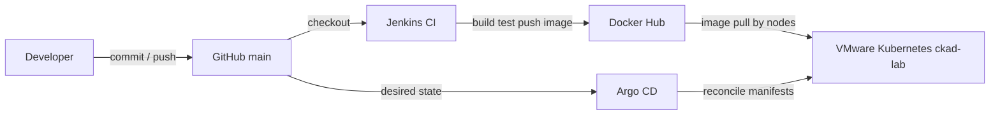

# GitOps flow

Status: Argo CD is installed on the VMware `ckad-lab` cluster and reconciles Application `platform-lab-local` from Git. CD is live for the local overlay, including the `0.1.1` image promotion. The AWS overlay is not managed yet.

## CI versus CD

| Concern | System | Does | Does not |
|---|---|---|---|
| CI | Jenkins on Docker Desktop | Test, build, validate, publish image | `kubectl apply`, cluster edits |
| CD | Argo CD on `ckad-lab` | Read Git, sync manifests to the cluster | Build or push images |

Git is the source of truth for Kubernetes desired state under `kubernetes/overlays/local`. Argo CD is the reconciler. Jenkins stops at Docker Hub.

## Installed components

| Piece | Value |
|---|---|
| Argo CD version | `v3.5.3` (`quay.io/argoproj/argocd:v3.5.3`) |
| Namespace | `argocd` on context `ckad-lab` only |
| AppProject | `gitops/projects/platform-lab.yaml` |
| Application | `gitops/applications/platform-lab-local.yaml` |
| Source | `https://github.com/kirandevraaj/kubernetes-platform-engineering-gitops.git`, revision `main`, path `kubernetes/overlays/local` |
| Destination | server `https://kubernetes.default.svc`, namespace `platform-lab` |

`https://kubernetes.default.svc` is the in-cluster API of the same VMware cluster that hosts Argo CD (external API `https://192.168.56.10:6443`). The Application never targets `docker-desktop`.

## Sync policy

Automated sync is enabled with:

- **prune: true** — objects removed from the overlay path are removed from the cluster.
- **selfHeal: true** — live drift is restored to the Git state.
- **CreateNamespace=true** — the `platform-lab` namespace may be created if missing.
- **ApplyOutOfSyncOnly=true** — only drifted resources are applied.

That policy fits this personal lab: Git remains authoritative, and the self-heal demo does not need a manual sync click.

## Reconciliation loop

1. A commit lands on `main` that changes `kubernetes/overlays/local` (or its base).
2. Argo CD detects the revision and marks the Application OutOfSync when live objects differ.
3. Automated sync applies the rendered overlay.
4. Status returns to Synced and Healthy when the live objects match Git.

Manual cluster edits are temporary. With self-heal, Argo CD restores the Git values.

## Observed lab demos (24 September 2026)

**Git-driven change.** Commit `e2b7964` changed ConfigMap `APP_ENVIRONMENT` from `local` to `local-gitops`. After a hard refresh, Application `platform-lab-local` moved to revision `e2b7964`, status Synced/Healthy, and the live ConfigMap showed `local-gitops`. The OutOfSync window was shorter than the five-second poll interval during that refresh.

**Self-heal.** The live ConfigMap was patched to `APP_ENVIRONMENT=manual-drift`. Argo CD reported OutOfSync, then restored `local-gitops` and returned to Synced/Healthy within a few seconds. Deployment stayed 2/2 Ready; replicas were not changed.

**Image promotion 0.1.1.** After Jenkins published `kirandevraaj/platform-lab:0.1.1`, commit `a8ca030` set the local overlay image tag to `0.1.1`. Argo CD reconciled that Git change automatically. The live Deployment rolled to `0.1.1` without a manual `kubectl apply`. Both pods ran the new image. `GET /` showed version `0.1.1`, environment `local-gitops`, and release `ci-cd-integration-test`.

CI publishing the image and GitOps changing the desired image tag are separate steps. Docker Hub alone does not move the cluster.

## Repository map

| Path | Contents |
|---|---|
| `kubernetes/base` | Shared workload manifests |
| `kubernetes/overlays/local` | Local lab overlay watched by Argo CD |
| `kubernetes/overlays/aws` | AWS overlay (not applied, not watched yet) |
| `gitops/projects` | AppProject definitions |
| `gitops/applications` | Application definitions |
| `gitops/appsets` | Reserved for ApplicationSets |

Local and AWS Applications stay as separate objects so a sync of one cannot select the other cluster.
