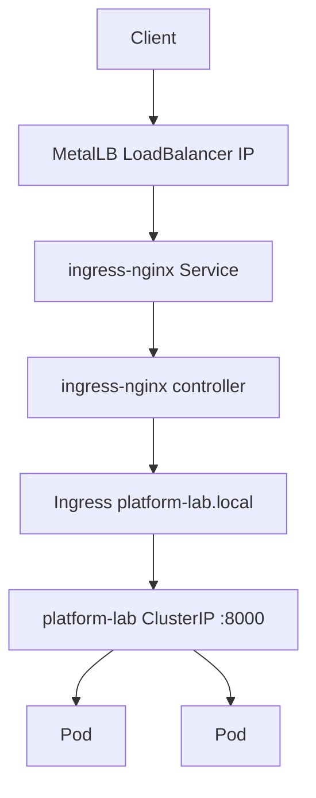

# Local Kubernetes networking

Status: `platform-lab` Ingress and NetworkPolicy live in `kubernetes/base`. The local overlay also patches the existing `ingress-nginx-controller` Service to **LoadBalancer** so MetalLB (L2) advertises a VIP on the host-only network. Application Service stays ClusterIP. TLS is not configured yet.

## Traffic path (local lab)

```text
Windows host
    |
    |  HTTP :80  (Host: platform-lab.local)
    v
MetalLB LoadBalancer VIP (L2 ARP on 192.168.56.0/24)
    |
    v
Service ingress-nginx-controller (namespace ingress-nginx)
    |
    v
ingress-nginx controller pod
    |
    v
Ingress platform-lab (host platform-lab.local, path /)
    |
    v
Service platform-lab :8000 (ClusterIP)
    |
    v
platform-lab Pods :8000
```



## MetalLB

| Field | Observed value |
|---|---|
| Version | `quay.io/metallb/controller:v0.16.1` |
| Mode | **L2** (`L2Advertisement` `lab-l2`; no BGPAdvertisements) |
| Pool | `lab-pool` in `metallb-system` |
| Addresses | `192.168.56.200-192.168.56.210` (`autoAssign: true`) |
| Speakers | DaemonSet on `k8s-ctrl-01`, `k8s-worker-01`, `k8s-worker-02` |

MetalLB is **not** a cloud provider managed load balancer. On this bare-metal / VMware lab it answers ARP for the VIP on the host-only LAN so clients can use a stable IP:80 instead of NodeIP:NodePort.

The MetalLB pool and L2Advertisement were left unchanged. The VIP is assigned dynamically from `lab-pool`.

## ingress-nginx external Service (local overlay only)

| Field | Value |
|---|---|
| Manifest | `kubernetes/overlays/local/ingress-nginx-controller-service.yaml` |
| Object | Existing Service `ingress-nginx-controller` in namespace `ingress-nginx` |
| Change | `type: NodePort` → `type: LoadBalancer` |
| Ports | 80 → http, 443 → https (preserved) |
| Selector | Unchanged controller labels |
| `externalTrafficPolicy` | `Cluster` (preserved) |
| AWS overlay | Does **not** include this Service |

This repository does not install or own the ingress-nginx Helm release. It only GitOps-manages the controller Service’s external type for the local lab.

## NodePort versus LoadBalancer

| Mode | Path |
|---|---|
| NodePort (previous) | Client → `192.168.56.1x:30080` → ingress-nginx |
| LoadBalancer + MetalLB (current) | Client → `<VIP>:80` → ingress-nginx |

LoadBalancer + MetalLB is useful on a local bare-metal style cluster because callers get a single LAN IP on the normal HTTP port without remembering a NodePort.

NodePorts may still appear on the Service after the type change (Kubernetes behavior); final validation uses the MetalLB EXTERNAL-IP on port 80, not 30080.

## Ingress

| Field | Value |
|---|---|
| Manifest | `kubernetes/base/ingress.yaml` |
| Host | `platform-lab.local` |
| Path | `/` Prefix → Service `platform-lab:8000` |
| IngressClass | `nginx` |

## NetworkPolicy

| Field | Value |
|---|---|
| Manifest | `kubernetes/base/networkpolicy.yaml` |
| Allows | ingress-nginx controller → TCP/8000 on app pods |
| Egress | Not restricted in this policy |

## Application Service

`platform-lab` remains **ClusterIP** on port 8000. It is never changed to LoadBalancer.

## Why this lives in GitOps

Desired networking state is committed under `kubernetes/`. Argo CD Application `platform-lab-local` reconciles it. Jenkins does not apply cluster networking. AppProject `platform-lab` allows destinations `platform-lab` and `ingress-nginx` so the local overlay may patch the controller Service.

## Local versus future AWS

| Concern | Local lab | AWS (later) |
|---|---|---|
| Entry | MetalLB VIP → ingress-nginx LoadBalancer | Cloud LB / different Service annotations |
| Host | `platform-lab.local` | Environment-specific hostname |
| Overlay | Local patches ingress-nginx Service type | AWS overlay unchanged; no MetalLB Service |

## Validation results

Filled after MetalLB LoadBalancer reconciliation.
