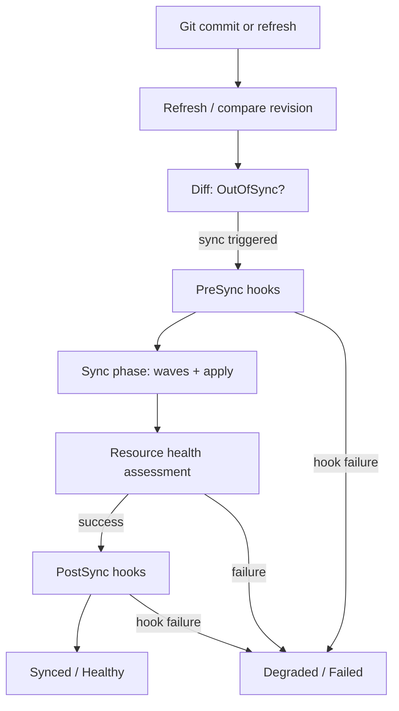
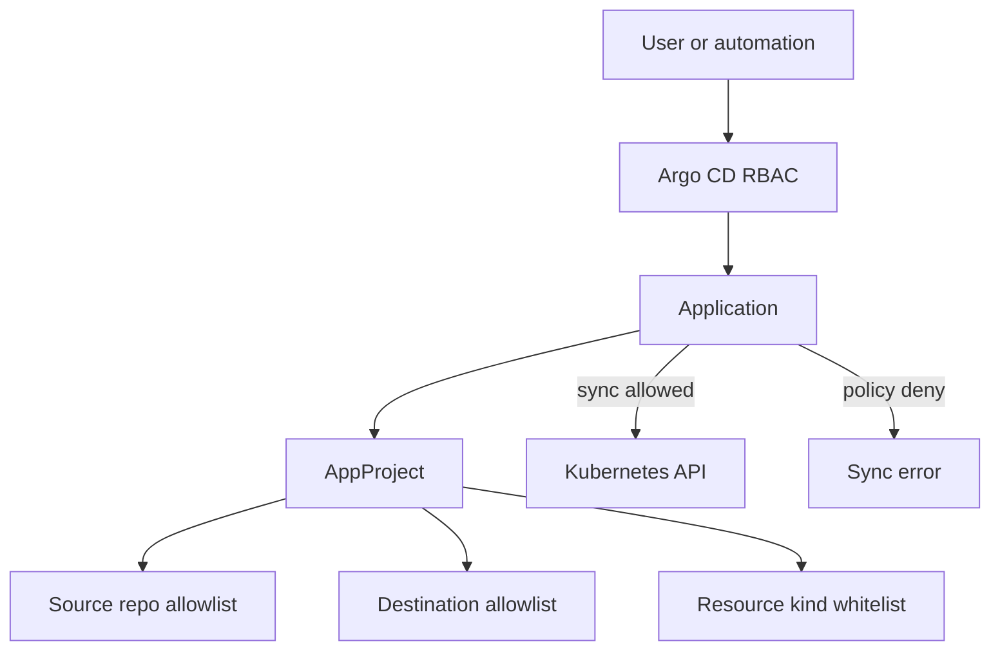
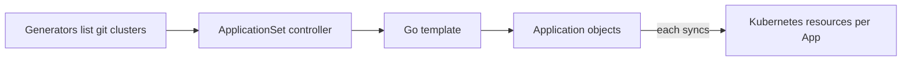
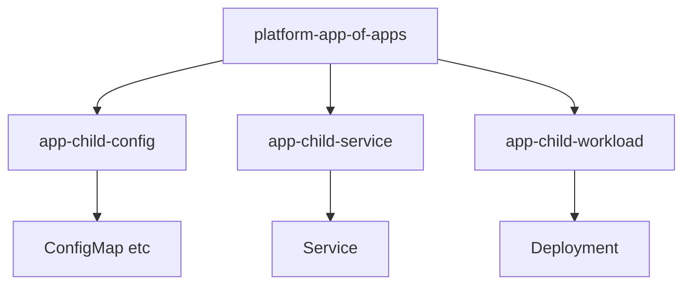
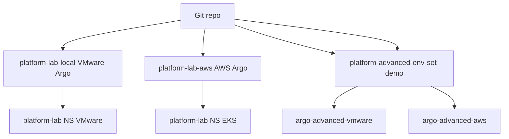

# Advanced Argo CD GitOps Patterns

**Project:** Kubernetes Platform Engineering & GitOps Lab · **Milestone:** Section 23  
**Date:** 2026-09-26  
**Repository:** `https://github.com/kirandevraaj/kubernetes-platform-engineering-gitops.git`

| Argo instance | Version | Context |
|---------------|---------|---------|
| VMware | `quay.io/argoproj/argocd:v3.5.3` | `ckad-lab` |
| AWS (EKS) | `quay.io/argoproj/argocd:v3.1.0` | via `platform-aws-tools` |

Before this milestone: **no ApplicationSets** and **no remote cluster Secrets** on either Argo CD (each reconciles **in-cluster only**). Production-like Applications were not renamed or repointed. Platform lab image remains **0.1.4** at digest `sha256:1cca2b5964043fe6c9c09f17d7f86a3572a46699602919d15c45c9a069b872ff`.

**Diagrams (SVG):** [Sync lifecycle](./diagrams/argo-sync-lifecycle.svg) · [App-of-Apps](./diagrams/argo-app-of-apps.svg) · [ApplicationSet](./diagrams/argo-applicationset.svg) · [AppProject security](./diagrams/argo-project-security.svg) · [Advanced reference](./diagrams/argo-advanced-gitops-reference.svg) · [Enterprise composition](./diagrams/argo-enterprise-gitops-composition.svg)

---

## 1. Why Advanced GitOps Patterns Exist

A platform team’s first GitOps step is a handful of **Applications**—enough for one app and one cluster. Growth introduces repetition (many envs), ordering (CRDs before CRs), guardrails (who may deploy what), and bootstrap (installing Argo objects from Git). Advanced patterns—**sync phases/waves**, **hooks**, **sync options**, **AppProjects**, **ApplicationSets**, **App-of-Apps**—address **different** problems. They are not interchangeable shortcuts; combining them without intent creates opaque control planes.

This milestone adds an **isolated learning lane** (`platform-advanced-lab`, namespaces `argo-advanced-*`, `argo-child-*`, `argo-nested-*`) while Jenkins still builds/publishes and Argo still reconciles Git on the existing VMware and AWS application fleets.

---

## 2. Current Project 1 GitOps Architecture

**Flow:** Developer → GitHub → Jenkins (CI: test, image publish, Git promotion) + Argo CD (CD: diff/sync/prune/self-heal) → Kubernetes.

### VMware inventory (`ckad-lab`)

| Environment | Application | Project | Source path | Destination namespace | Sync policy | Prune | SelfHeal | Sync options |
|-------------|-------------|---------|-------------|----------------------|-------------|-------|----------|--------------|
| VMware | platform-lab-local | platform-lab | kubernetes/overlays/local | platform-lab | automated | true | true | CreateNamespace=true, ApplyOutOfSyncOnly=true |
| VMware | platform-lab-observability | platform-lab-observability | Helm + git (monitoring stack) | monitoring | automated | true | true | CreateNamespace=true, ServerSideApply=true, ApplyOutOfSyncOnly=true |
| VMware | platform-security-vmware | platform-security-vmware | kubernetes/security-lab-vmware | security-lab | automated | true | true | CreateNamespace=true, ApplyOutOfSyncOnly=true |
| VMware | platform-storage-vmware | platform-storage-vmware | kubernetes/storage-lab | storage-lab | automated | true | true | CreateNamespace=true, ApplyOutOfSyncOnly=true |

### AWS inventory (EKS)

| Environment | Application | Project | Source path | Destination namespace | Sync policy | Prune | SelfHeal | Sync options |
|-------------|-------------|---------|-------------|----------------------|-------------|-------|----------|--------------|
| AWS | platform-lab-aws | platform-lab-aws | kubernetes/overlays/aws | platform-lab | automated | true | true | CreateNamespace=true, ApplyOutOfSyncOnly=true |
| AWS | platform-storage-aws | platform-storage-aws | kubernetes/storage-lab-aws | storage-lab | automated | true | true | CreateNamespace=true, ApplyOutOfSyncOnly=true |
| AWS | platform-security-aws | platform-security-aws | kubernetes/security-lab-aws | security-lab | automated | true | true | CreateNamespace=true, ApplyOutOfSyncOnly=true |
| AWS | platform-observability-aws | platform-observability-aws | Helm charts | observability | automated | true | true | CreateNamespace=true, ServerSideApply=true, ApplyOutOfSyncOnly=true |
| AWS | platform-k8s-metrics-aws | platform-k8s-metrics-aws | Helm | observability | automated | true | true | CreateNamespace=true, ServerSideApply=true, ApplyOutOfSyncOnly=true |

### New advanced lab objects (VMware)

| Type | Name | Notes |
|------|------|--------|
| AppProject | platform-advanced-lab | Restricted repos, destinations, kinds |
| Application | platform-argo-advanced-lab | Hooks, waves, sync options demo |
| Application | platform-app-of-apps | Child Application composition |
| Application | platform-app-of-applicationsets | Installs nested ApplicationSet |
| ApplicationSet | platform-advanced-set | List → dev/test/stage |
| ApplicationSet | platform-advanced-git-set | Git generator (experiment) |
| ApplicationSet | platform-advanced-env-set | Conceptual multi-env |
| ApplicationSet | platform-advanced-cluster-set | Label-selected cluster Secret |
| ApplicationSet | platform-nested-list-set | App-of-ApplicationSets |

---

## 3. Application vs AppProject vs ApplicationSet vs App-of-Apps

| Object | One-line role | Project 1 example |
|--------|---------------|-------------------|
| **Application** | Deploy this Git path to this destination | `platform-lab-local` → `kubernetes/overlays/local` |
| **AppProject** | Policy: allowed repos, namespaces, resource kinds | `platform-advanced-lab` whitelists lab namespaces + `argocd` |
| **ApplicationSet** | Generate N Applications from generators + template | `platform-advanced-set` → three env Applications |
| **App-of-Apps** | One Application whose manifests are other Applications | `platform-app-of-apps` → `app-child-*` |

**Application** answers *what to run*. **AppProject** answers *what is allowed*. **ApplicationSet** answers *how to factory Applications*. **App-of-Apps** answers *how to bootstrap the Application graph from Git*.

---

## 4. Sync Lifecycle

When Git changes (or refresh runs), Argo CD loads manifests, compares to live cluster state, and optionally executes a **sync operation** through hooks, waves, and health checks.



Static reference: [argo-sync-lifecycle.svg](./diagrams/argo-sync-lifecycle.svg)

Automated sync on production-like apps uses **prune** and **selfHeal** so live drift returns to Git; advanced lab adds explicit hook and wave evidence in `platform-argo-advanced-lab`.

---

## 5. Sync Phases

Phases partition the sync operation lifecycle:

| Phase | Meaning |
|-------|---------|
| **PreSync** | Runs before main resources (often validation Jobs) |
| **Sync** | Normal apply/prune of tracked manifests |
| **PostSync** | Runs after sync (verification Jobs) |
| **SyncFail** | Runs when sync fails (lab-only controlled failure) |

Phases are coarse **when** boundaries. **Waves** (§6) order resources **within** a phase.

---

## 6. Sync Waves

Annotations `argocd.argoproj.io/sync-wave: "<integer>"` order resources during Sync. Tie-breakers: phase → wave → kind → name.

**Lab (`kubernetes/argo-advanced-lab/waves/`):** ConfigMap wave `-1`, Service `0`, Deployment `1`.  
**App-of-Apps children:** `app-child-config` `-1`, `app-child-service` `0`, `app-child-workload` `1`.

Health-gated progression is exercised in `kubernetes/argo-advanced-lab/waves-health/` (dependency must become healthy before later wave proceeds).

---

## 7. Combining Phases and Waves

The combined lab path (`kubernetes/argo-advanced-lab/combined/`) demonstrates:

```text
PreSync (hook)     → validation Job
Sync wave -1/0/1   → ConfigMap / Service / Deployment
PostSync (hook)    → wave 2 verification Job
```

**Phase** = lifecycle stage. **Wave** = ordering inside that stage. This distinction prevents misplacing long-running work in hooks or ignoring ordering inside Sync.

---

## 8. Hooks

Hooks are temporary or operational resources executed at lifecycle points. Lab Jobs (`kubernetes/argo-advanced-lab/hooks/`):

| Job | Hook | Purpose |
|-----|------|---------|
| argo-pre-sync-check | PreSync | Harmless namespace/context check before apply |
| argo-post-sync-check | PostSync (+ wave 2) | Harmless verification after apply |
| (SyncFail experiment) | SyncFail | Controlled non-zero exit; removed after observation |

Hooks must not mutate production data, call external systems, or read Secrets in this lab.

---

## 9. Hook Lifecycle

Hook resources are not ordinary long-lived objects. Annotations:

- `argocd.argoproj.io/hook-delete-policy: HookSucceeded,HookFailed` — delete Job after completion so the next sync can recreate it
- Optional: `BeforeHookCreation` — delete previous hook resource before re-run

Argo CD waits for hook Jobs to complete (success or failure per policy) before advancing the operation. Lab Jobs intentionally omit `ttlSecondsAfterFinished` so completion behavior is visible in sync history.

---

## 10. Hook Idempotency

Every sync may re-run hooks. PreSync/PostSync Jobs must be **safe to repeat** (read-only checks, idempotent scripts). Avoid hooks that send irreversible commands or assume “run once ever.” Re-trigger sync on `platform-argo-advanced-lab` to observe hook re-creation and cleanup per delete policy.

---

## 11. Sync Options

Per-Application `syncOptions` change apply/prune behavior.

| Option | Purpose | Lab / production use |
|--------|---------|----------------------|
| CreateNamespace=true | Create destination NS if missing | All production-like apps + advanced lab |
| ApplyOutOfSyncOnly=true | Apply only changed resources | Widely used in Project 1 |
| ServerSideApply=true | SSA for large objects / CRDs | Observability Helm apps; `platform-argo-advanced-lab` |
| PruneLast=true | Defer prune until after other resources | `platform-argo-advanced-lab` |
| Prune=false / Prune=confirm | Limit or confirm pruning | Documented in sync-options notes |
| SkipDryRunOnMissingResource=true | Skip dry-run when CRD missing | Documented only |
| Replace=true / Force=true | Aggressive recreate | **Documented only** — see §33 |
| Delete=false | Skip resource deletion during sync | Documented only |

Deep dive: `kubernetes/argo-advanced-lab/sync-options/notes.yaml`.

---

## 12. AppProjects

`gitops/projects/platform-advanced-lab.yaml` defines:

- **sourceRepos:** single GitHub repo (no `*`)
- **destinations:** explicit lab namespaces + `argocd` on in-cluster server
- **namespaceResourceWhitelist:** minimal kinds for demos + `Application` / `ApplicationSet`
- **clusterResourceWhitelist:** Namespace only
- **roles:** `lab-readonly`, `lab-syncer` (conceptual Casbin policies)
- **syncWindows:** `[]` by default
- **orphanedResources.warn:** true

Production apps remain on their existing projects (`platform-lab`, `platform-lab-aws`, etc.).

---

## 13. AppProject Security Boundary

AppProject is enforced at admission/sync time—not merely labels. Invalid combinations (wrong namespace, disallowed kind, wrong repo) fail with project violations.



See [argo-project-security.svg](./diagrams/argo-project-security.svg). Safe lab tests use out-of-scope namespace or kind—no dangerous cluster objects.

---

## 14. ApplicationSet

ApplicationSet controller expands **generators** + **template** into Application objects. Steady-state sets live under `gitops/appsets/` (kustomization applies list, env, cluster sets—not the Git experiment set).



See [argo-applicationset.svg](./diagrams/argo-applicationset.svg).

---

## 15. Generators

Generators produce parameter sets merged into the template:

| Generator | Parameters (examples) |
|-----------|------------------------|
| **List** | `env`, `namespace`, `path` |
| **Git** | directory path, branch |
| **Cluster** | `name`, `server`, label metadata |

All Project 1 sets use `goTemplate: true` and `missingkey=error` so template typos fail loudly.

---

## 16. List Generator

**`platform-advanced-set`:** elements `dev`, `test`, `stage` → Applications `argo-advanced-{env}` → paths `kubernetes/argo-advanced-apps/{env}` → namespaces `argo-advanced-{env}`.

**`platform-nested-list-set`:** nested-dev/test → `argo-nested-*` namespaces (App-of-ApplicationSets).

One manifest replaces three hand-written Applications with identical structure.

---

## 17. Git Generator

**`platform-advanced-git-set`** discovers directories under `kubernetes/argo-advanced-apps/*`. Intended as a **temporary experiment** (documented in `gitops/appsets/README.md`) because it can overlap list-generated Apps if left on simultaneously. Steady state prefers explicit **list** generator for predictable names and review.

Demonstrates: **repository layout drives Application count**.

---

## 18. Cluster Generator

**Limitation (Project 1):** VMware and AWS run **separate Argo CD instances**. Neither registers the other as a cluster Secret. There are **no cross-cluster secrets**, so a fleet-wide cluster generator across EKS + VMware is **not** available without registering remote clusters and credentials.

**`platform-advanced-cluster-set`** uses:

```yaml
clusters:
  selector:
    matchLabels:
      platform-lab.io/advanced-lab: "true"
```

Only Secrets with that label participate—never `selector: {}` for all clusters. A lab-only in-cluster Secret enables the pattern without exposing credentials. Real multi-cluster GitOps would register each cluster on a **hub** Argo CD with locked-down RBAC.

---

## 19. ApplicationSet Template

Template defines each generated Application’s `spec`: **hard-coded** `project: platform-advanced-lab`, repo URL, `path`, `destination`, `syncPolicy`. Generator fields substitute via Go templates (`{{.env}}`, `{{.namespace}}`, cluster `{{.server}}`, etc.).

Templating `project: default` or `destination: '*'` would be an escalation path—avoided here.

---

## 20. ApplicationSet Preview

Before applying a new Set, render expected Applications:

```bash
argocd appset generate gitops/appsets/platform-advanced-set.yaml
```

Compare output to `kubectl get applications -n argocd` after apply. Use in PR review alongside diff of generator elements.

---

## 21. App-of-Apps

Parent **`platform-app-of-apps`** syncs `kubernetes/argo-app-of-apps/children` to `argocd`. Children sync workload paths under `kubernetes/argo-app-of-apps-workloads/*` into `argo-child-*` namespaces. Parent never applies Deployments directly.



See [argo-app-of-apps.svg](./diagrams/argo-app-of-apps.svg).

---

## 22. App-of-ApplicationSets

**`platform-app-of-applicationsets`** syncs `kubernetes/argo-app-of-applicationsets/` containing **`platform-nested-list-set`**, which generates Applications → namespaces `argo-nested-dev`, `argo-nested-test`.

```text
Application (platform-app-of-applicationsets)
  └── ApplicationSet (platform-nested-list-set)
        └── Applications (nested-advanced-*)
              └── Kubernetes resources
```

Keeps ApplicationSet bootstrap in Git without kubectl. Tree stays small to avoid recursion (§27).

---

## 23. Multi-Environment Composition

Real Project 1 split: **`platform-lab-local`** (VMware Argo) vs **`platform-lab-aws`** (AWS Argo)—separate instances, overlays, and AppProjects.

Advanced lab **models** envs without replacing those apps:

| Mechanism | What it shows |
|-----------|----------------|
| `platform-advanced-set` | dev/test/stage namespaces on one cluster |
| `platform-advanced-env-set` | Parameters `environment`, `cluster`, `path`, `namespace` for `advanced-platform-vmware` / `advanced-platform-aws` (both sync via VMware in-cluster API as **demos**) |



Production truth remains the dedicated Applications per cloud; demos illustrate parameterization only.

---

## 24. Ownership and Reconciliation

- **ApplicationSet controller** owns generated Applications (ownerReferences); manual delete → regeneration on reconcile.
- Each **Application** owns its synced Kubernetes resources for prune/tracking purposes.
- **App-of-Apps** parent owns child Application manifests in Git; children own workloads.

Understanding ownership clarifies why deleting a generated App or removing a list element behaves differently from deleting a standalone `platform-lab-local`.

---

## 25. Pruning

With **automated prune: true**, resources removed from Git are deleted in cluster. **ApplicationSet:** removing a generator element marks the Application extraneous; controller may delete it (lab-only validation on `stage` or nested envs—never on production apps). **PruneLast** on advanced lab reduces risky ordering during prune. Production apps use standard prune without `Replace`/`Force`.

---

## 26. Sync Windows

Sync windows on AppProject or Application constrain **when** sync is allowed (cron, manual vs automated). Distinct from AppProject **where/what** and RBAC **who**. `platform-advanced-lab` ships with empty windows; lab may temporarily add a deny window on an advanced Application for Phase 31, then restore `[]` so production apps are unaffected.

---

## 27. Project Roles

`platform-advanced-lab` defines:

- **lab-readonly** — `get` applications in project
- **lab-syncer** — `get` + `sync` without create/delete/admin

Demonstrates least-privilege slices without binding real OIDC groups in the lab.

---

## 28. Security Risks

| Risk | Mitigation in Project 1 |
|------|-------------------------|
| ApplicationSet + weak AppProject | Template fixed to `platform-advanced-lab` |
| Broad cluster generator | Label selector only; no remote cluster sprawl |
| App-of-Apps bypass | Children still bound by same AppProject |
| Destructive sync options | Replace/Force documented, not on production workloads |
| Recursive bootstrap | Paths reviewed to prevent cycles |
| Cluster Secret exposure | No cross-cluster registration in milestone |

---

## 29. Common Anti-Patterns

- One `default` project with `*` repos and destinations
- ApplicationSet generating Applications into `default` project
- Hooks that migrate databases or rotate credentials on every sync
- App-of-Apps with parent and child managing the same workload path
- Using **Force** to “fix” OutOfSync instead of fixing Git or ignoreDifferences
- Duplicating list + Git generators targeting the same paths (name collisions)

---

## 30. VMware vs AWS GitOps Usage

| Aspect | VMware | AWS |
|--------|--------|-----|
| Argo CD version | v3.5.3 | v3.1.0 |
| Context | ckad-lab | EKS / platform-aws-tools |
| Core app | platform-lab-local | platform-lab-aws |
| Ingress | ingress-nginx / MetalLB | ALB |
| Observability app | platform-lab-observability | platform-observability-aws, platform-k8s-metrics-aws |
| Advanced lab | Implemented on VMware | Not duplicated on AWS in this milestone |
| Multi-cluster | Separate instances; no shared ApplicationSet across both |

Same Git repo; **different Argo reconcilers** per environment—intentional blast-radius isolation.

---

## 31. Project 1 Current Architecture

Coherent story: **Git** declares everything Jenkins may promote (image) and Argo may apply (manifests). **Jenkins** never deploys. **Argo** never builds. Existing fleet handles platform lab, storage, security, observability. **Advanced lane** teaches control-plane composition under `platform-advanced-lab` without altering `platform-lab` image digest or production Application specs.

Repository map: `gitops/{projects,applications,appsets}`, `kubernetes/argo-advanced-lab/`, `kubernetes/argo-app-of-apps/`, `kubernetes/argo-advanced-apps/`, `kubernetes/argo-app-of-applicationsets/`.

Full reference: [architecture/argo-gitops-reference.md](./architecture/argo-gitops-reference.md).

---

## 32. When to Use Each Pattern

| Pattern | Solves | Use When | Avoid When |
|---------|--------|----------|------------|
| Application | Single declarative deployment | One env/service with stable lifecycle | Many near-identical apps (use Set) |
| AppProject | Trust boundary for sources/destinations/kinds | Multi-team or multi-tenant Argo | Trying to replace K8s RBAC entirely |
| Sync Wave | Ordered apply within Sync | CRD→CR, config→deployment | Long-running orchestration (use hook or pipeline) |
| Hook | Point-in-time action in sync | Migrations, smoke tests, validation Jobs | Permanent desired state |
| ApplicationSet | DRY Application factory | Repeated env/cluster/path matrix | One or two apps (manual is clearer) |
| App-of-Apps | Bootstrap Application graph | Install child Apps from Git on new cluster | Deep nesting without projects |
| App-of-ApplicationSets | Bootstrap sets from Git | Platform team ships Sets as data | Uncontrolled recursion |
| Sync Window | Time-based sync gate | Change freezes, maintenance | Routine daily deploys (friction) |
| Sync Option | Fine-tune apply/prune | SSA, namespace creation, out-of-sync only | Force-fix production drift |

Patterns solve **different** problems—do not stack them “because Argo supports it.”

---

## 33. When NOT to Use Each Pattern

- **ApplicationSet** when you have two apps and no forecast of growth—operational overhead wins.
- **App-of-Apps** when a single Application or Helm umbrella suffices.
- **Hooks** for controllers or continuous reconciliation—use Deployments or operators.
- **Replace/Force** on StatefulSets, PVCs, or production Deployments—use Git rollback.
- **Cluster generator** without labeled, audited cluster Secrets—risk wrong cluster blast radius.
- **Multi-pattern combo** on the same production Application before understanding sync history.

---

## 34. Experiments Performed

Isolated to advanced lab unless noted:

1. AppProject enforcement (invalid destination/kind/repo)
2. Sync options on `platform-argo-advanced-lab` (CreateNamespace, ApplyOutOfSyncOnly, PruneLast, SSA)
3. Sync waves ordering (`waves/`, App-of-Apps child waves)
4. Health-gated waves (`waves-health/`)
5. PreSync / PostSync / SyncFail hooks (`hooks/`)
6. Combined phase + wave + hook (`combined/`)
7. App-of-Apps three-child tree
8. ApplicationSet list / env / cluster / git (git temporary)
9. ApplicationSet preview (`argocd appset generate`)
10. App-of-ApplicationSets nested list
11. Generator element removal / manual Application delete (lab names only)
12. Sync window deny/allow (lab app, restored)
13. Project roles (documented policies)

Live evidence captured on VMware `ckad-lab` via Argo UI/CLI per Phase 40—see §35.

---

## 35. Experiment Results

### Failure and edge cases

| Scenario | Expected Behavior | Observed | Risk |
|----------|-------------------|----------|------|
| Failed PreSync hook | Sync aborts; app not fully synced | Pending live validation — see Experiments | Blocked deploy |
| Failed PostSync hook | Sync marked failed after apply | Pending live validation — see Experiments | False-negative release |
| Wave dependency unhealthy | Later waves wait | Pending live validation — see Experiments | Stalled rollout |
| ApplicationSet input removed | Generated App pruned/removed | Pending live validation — see Experiments | Accidental env teardown if mis-scoped |
| Generated Application manually deleted | Controller recreates | Pending live validation — see Experiments | Brief outage if workload-only delete |
| Out-of-project destination | Project validation error | Pending live validation — see Experiments | Policy bypass if ignored |
| Unapproved resource kind | Denied sync | Pending live validation — see Experiments | Incomplete deploy |
| Sync Window denied | Sync blocked in window | Pending live validation — see Experiments | Change freeze surprise |
| Hook rerun | Job recreated per policy | Pending live validation — see Experiments | Duplicate side effects if not idempotent |
| Child Application unhealthy | Parent may show Degraded | Pending live validation — see Experiments | Cascaded status noise |

Live results will be recorded on the VMware lab during validation runs; do not treat “Pending” as failure.

---

## 36. Production Design Considerations

- Keep **one AppProject per trust domain** (team/env), not one global project.
- Prefer **digest-pinned** promotions (Project 1 platform-lab) over floating tags.
- Use **ApplyOutOfSyncOnly** + **selfHeal** for drift; tune **ignoreDifferences** for HPA-owned fields.
- Bootstrap new clusters with **App-of-Apps** root + locked projects before ApplicationSets.
- ApplicationSet templates must be **code-reviewed** like Terraform modules.
- **Replace/Force** only in break-glass runbooks—not default sync options.
- Multi-cluster: hub Argo with explicit cluster Secrets, narrow labels, audit logging.

---

## 37. Lessons Learned

1. **Phase vs wave** is the most commonly confused pair—teach with one combined diagram.
2. **App-of-Apps is not security**—AppProject still enforces boundaries.
3. **Separate Argo instances** (VMware/AWS) simplify blast radius but prevent naive cluster generators.
4. **Git + list generator** beats Git generator when you need stable Application names and no overlap.
5. **Hooks belong in the lab** until idempotency and delete policies are proven.
6. **Production Applications stay boring**—advanced patterns live in `platform-advanced-lab`.

---

## 38. Future Improvements

- Register EKS on a dedicated **hub** Argo CD with documented cluster Secret lifecycle (if multi-cluster is a goal).
- Promote selected sync options (e.g. PruneLast) to production apps after measured rollout.
- Wire OIDC groups to `lab-readonly` / `lab-syncer` equivalents in a real IdP.
- Capture §35 **Observed** column from automated sync tests in CI (argocd CLI assertions).
- Align AWS Argo CD version with VMware (v3.5.x) after regression testing.
- Extend [argo-cd-interview-notes.md](./argo-cd-interview-notes.md) with runbook links per failure row.

---

## Conceptual model glossary

These concepts solve **different** problems; combine them deliberately, not by default.

| Term | Meaning |
|------|---------|
| **APPLICATION** | “Deploy this workload.” |
| **APPPROJECT** | “Allow this source to deploy these resources into these destinations.” |
| **APPLICATIONSET** | “Generate Applications from data/templates.” |
| **APP-OF-APPS** | “Use Applications to compose Applications.” |
| **SYNC PHASE** | “When in the lifecycle?” (PreSync, Sync, PostSync, …) |
| **SYNC WAVE** | “In what order?” within a phase |
| **HOOK** | “Run this controlled action at a lifecycle point.” |
| **SYNC OPTION** | “How should Argo CD perform synchronization?” |
| **SYNC WINDOW** | “When may synchronization occur?” |
| **RBAC** | “Who may perform the Argo operation?” |
| **Kubernetes** | “Actually run the desired resources.” |
| **Git** | “Authoritative desired state.” |
| **Jenkins** | “Build/test/publish/promote immutable artifacts.” |
| **Argo CD** | “Reconcile desired state.” |

---

**See also:** [argo-cd-interview-notes.md](./argo-cd-interview-notes.md) · [architecture/argo-gitops-reference.md](./architecture/argo-gitops-reference.md) · [vmware-argo-self-healing.md](./vmware-argo-self-healing.md)
