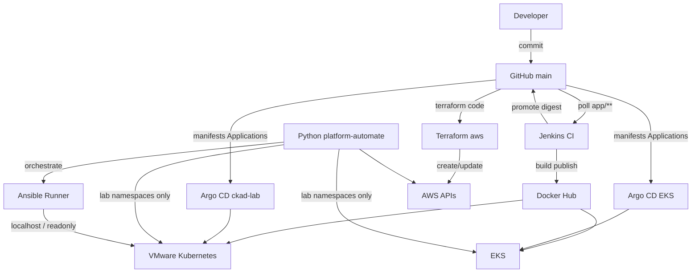
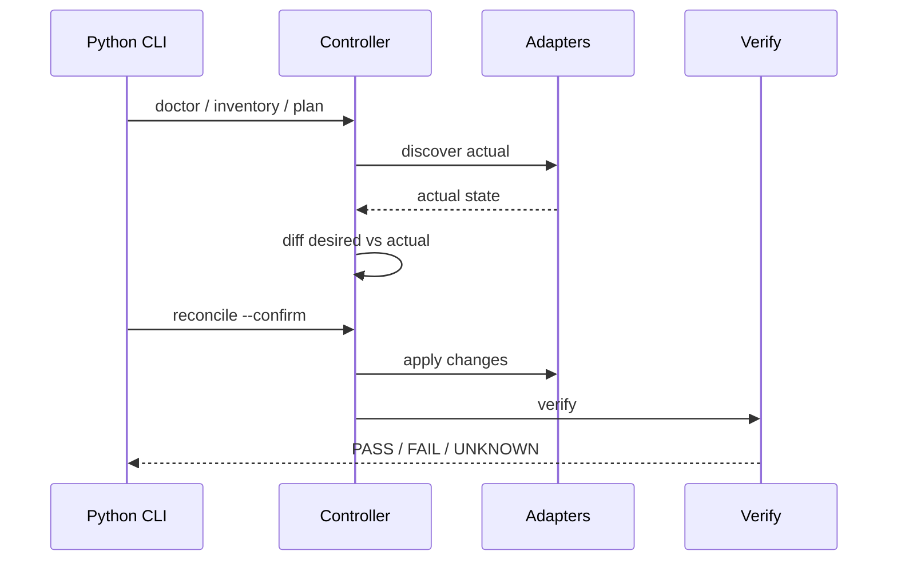
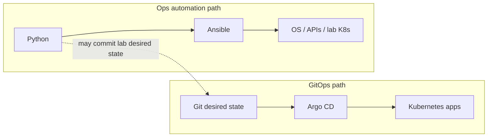

# Automation Architecture (Project 1)

**Status:** Section 24 — decision boundaries for Python, Ansible, Terraform, Kubernetes manifests, Argo CD, Jenkins, and Git.

**Clusters:** VMware `ckad-lab` (1.31.x) · AWS EKS `platform-lab-aws` (1.36.x)  
**App image (immutable pin):** `kirandevraaj/platform-lab:0.1.4` @ `sha256:1cca2b5964043fe6c9c09f17d7f86a3572a46699602919d15c45c9a069b872ff`

---

## Mental model (one page)

| Concern | System of record | Executor |
|---------|------------------|----------|
| Infrastructure lifecycle (VPC, EKS, IAM, LB controller bootstrap) | Terraform state + Git `terraform/aws` | Terraform plan/apply |
| Workload & GitOps desired state | Git manifests / overlays / Applications | Argo CD reconcile |
| Artifact production | Git `app/**` + Docker Hub digest | Jenkins CI |
| Multi-host OS / network config | Ansible inventory + playbooks | Ansible (often via Runner) |
| Cross-API logic, verify, report | Python package | Python CLI |
| AWS API calls from code | IAM + boto3 | Python |
| Kubernetes API calls from code | kubeconfig RBAC + client | Python |

Git is authoritative for **declared** platform and app state. Python/Ansible are authoritative for **operational procedures** that may *update Git* or *configure non-Git systems*, but must not silently bypass Argo for production apps.

---

## ASCII — desired state path (GitOps + infra)

```text
                        GitHub (main)
                             |
                    Desired state commits
                             |
              +--------------+--------------+
              |                             |
         Terraform                     Argo CD
     (terraform/aws)              (VMware v3.5.3 / AWS v3.1.0)
              |                             |
              v                             v
        AWS infrastructure           Kubernetes workloads
        VPC / EKS / IAM              platform-lab*, storage-lab*,
                                     security-lab*, observability*
                                     (+ automation-lab when Git-managed)
```

---

## ASCII — operational automation path

```text
                     Python CLI (platform-automate)
                               |
               discover → validate → plan → apply → verify → report
                               |
         +---------------------+---------------------+
         |                     |                     |
      Boto3               K8s client           Ansible Runner
         |                     |                     |
         v                     v                     v
      AWS APIs           K8s API server         Playbooks/roles
   (read / tagged)     (automation-lab)         (localhost / readonly)
         |                     |                     |
         +----------+----------+----------+----------+
                    |
              Verification + JSON report
```

This path is **separate** from Argo’s continuous reconcile loop. When automation must change Kubernetes *desired* state for a GitOps-managed app, it commits to Git and lets Argo sync — it does not long-term-own live objects that Argo also owns (especially `platform-lab`).

---

## ASCII — CI path (Jenkins)

```text
Developer push
     |
     v
  GitHub
     |
     +-- app/** -----> Jenkins (pollSCM)
     |                    |
     |                    +--> test / build / push image
     |                    +--> commit digest to overlays (local + aws)
     |                    +--> (automation pipeline) lint / dry-run / lab apply
     |
     +-- manifests ---> Argo CD --> clusters
```

**Hard boundary:** Jenkins does **not** `kubectl apply` production app desired state. Promotion is a Git commit; deployment is Argo CD.

---

## Mermaid — full composition



---

## Mermaid — automation lifecycle



---

## Mermaid — GitOps vs imperative automation



---

## Decision tree

```text
Need complex logic / multi-service branching?
  → Python

Need identical config on many hosts?
  → Ansible

Need create/change cloud infrastructure lifecycle?
  → Terraform

Need declare Kubernetes workload desired state?
  → Manifests / Kustomize / Helm in Git

Need continuous cluster reconciliation + self-heal?
  → Argo CD

Need build/test/publish artifacts + promote digest?
  → Jenkins

Need AWS API from code?
  → Boto3

Need Kubernetes API from code?
  → kubernetes Python client (32.0.1)

Need software to invoke Ansible with structure?
  → Ansible Runner
```

---

## Why Jenkins must not kubectl-apply apps

1. **Source of truth:** Live cluster would diverge from Git; Argo self-heal would revert or fight Jenkins.  
2. **Audit:** Digest promotion (`sha256:1cca2b…`) is a Git commit — kubectl apply leaves weak history.  
3. **Environments:** Dual promote to `overlays/local` and `overlays/aws` is intentional; direct apply breaks parity.  
4. **Rollback:** `git revert` + Argo sync beats “re-run Jenkins with old hope.”  
5. **Separation of duties:** CI produces artifacts; CD reconciles desired state (ADR-006).

---

## Safe vs forbidden mutation

| Allowed (lab) | Forbidden |
|---------------|-----------|
| `automation-lab` resources | `platform-lab` app objects |
| Read-only cluster/AWS inventory | VPC / EKS / ALB / Terraform state edits via ad-hoc scripts |
| Ansible localhost baseline | Mutating VMware worker OS as “automation” |
| Git commits for lab GitOps paths | Argo global / AppProject prod changes via scripts |

---

## Diagram assets

- [python-automation-stack.svg](../diagrams/python-automation-stack.svg)  
- [ansible-architecture.svg](../diagrams/ansible-architecture.svg)  
- [python-ansible-orchestration.svg](../diagrams/python-ansible-orchestration.svg)  
- [automation-vs-gitops.svg](../diagrams/automation-vs-gitops.svg)  
- [project1-automation-reference.svg](../diagrams/project1-automation-reference.svg)  

---

## Related

- [CI/CD flow](../architecture/ci-cd-flow.md)  
- [Argo GitOps reference](../architecture/argo-gitops-reference.md)  
- [Master guide](./platform-automation-master-guide.md)  
