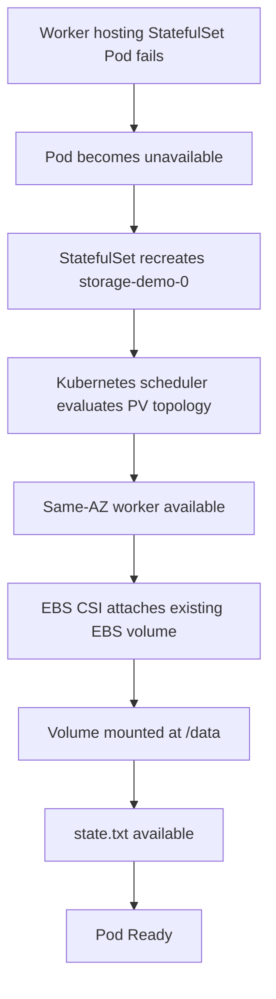
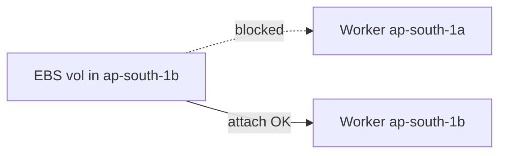
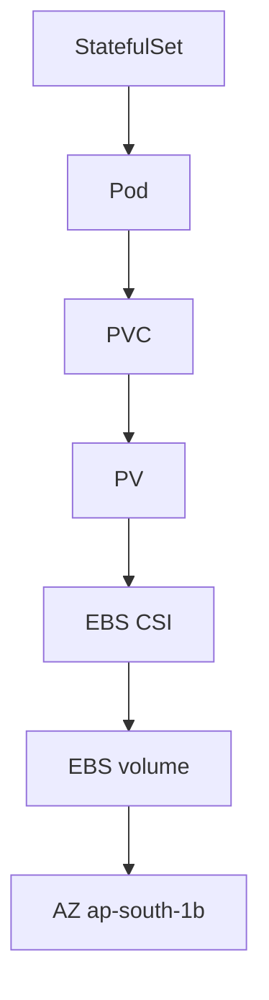

# AWS EKS EBS Storage Resilience and AZ Failure Analysis

**Date:** 2026-09-26  
**Environment:** AWS EKS (`platform-lab-aws` / `platform-lab-aws-lab-eks`) · `ap-south-1`  
**Scope:** Controlled **worker node failure** + **AZ topology** demonstration for `storage-lab`  
**Prerequisite lab:** [`docs/aws-storage-statefulset.md`](./aws-storage-statefulset.md) (Pod-delete persistence)  
**Argo Application:** `platform-storage-aws`

---

## 1. Objective

Prove three distinct statements:

1. **Pod resilience** (already proven): StatefulSet recreation retains PVC/PV/EBS data.  
2. **Node resilience** (this lab): a failed worker can be replaced by another worker in the **same Availability Zone**, allowing CSI to reattach the **same** EBS volume.  
3. **AZ boundary** (this lab): a single EBS volume is **not** cross-AZ storage.

Do **not** call this multi-AZ EBS resilience.

---

## 2. Baseline Architecture

```text
StatefulSet storage-demo
  → Pod storage-demo-0
  → PVC data-storage-demo-0
  → PV pvc-612d84fb-dbd4-46d9-a17f-735216f0594d
  → EBS CSI (ebs.csi.aws.com)
  → EBS vol-05faa26874d720ecd (gp3, 1 GiB)
  → AZ ap-south-1b
```

| Item | Baseline value |
|---|---|
| Pod node | `ip-10-50-52-64.ap-south-1.compute.internal` |
| Instance | `i-0cd6b629a5f2a70a8` |
| Node AZ | `ap-south-1b` |
| Nodegroup | `platform-lab-aws-lab-managed` |
| PVC / PV / EBS | Bound · `vol-05faa26874d720ecd` · `ap-south-1b` |

---

## 3. EBS CSI Architecture

Managed EKS add-on `aws-ebs-csi-driver` `v1.66.0-eksbuild.1` with Pod Identity on `ebs-csi-controller-sa`. CSI owns create/attach/detach. No manual EC2 attach/detach was used.

---

## 4. StatefulSet Storage Lifecycle

`volumeClaimTemplates` bind ordinal `0` to PVC `data-storage-demo-0`. Pod UID changes on recreation; PVC/PV/EBS identities do not.

---

## 5. Node and AZ Topology

| NODE | INSTANCE ID | AZ | NODEGROUP | READY |
|---|---|---|---|---|
| `ip-10-50-41-156…` | `i-07ca835528019f933` | **ap-south-1a** | `platform-lab-aws-lab-managed` | Ready |
| `ip-10-50-52-64…` | `i-0cd6b629a5f2a70a8` | **ap-south-1b** | `platform-lab-aws-lab-managed` | Ready |

**Finding:** only **one** Ready worker existed in the EBS AZ (`ap-south-1b`) before the experiment.

Private subnet for `ap-south-1b`: `subnet-036ba63f6c37d5bf0` (`10.50.48.0/20`).

---

## 6. Initial Pod Placement

Pod was on `ip-10-50-52-64` in `ap-south-1b`, matching EBS AZ and PV `nodeAffinity`.

---

## 7. Failure Injection Method

**Required temporary capacity:** Terraform-managed EKS node group `storage-resilience-test-1b` (1 × `t3.medium`, subnet **only** `ap-south-1b`), enabled only for this lab, then destroyed.

Recovery worker before failure:

| Field | Value |
|---|---|
| Node | `ip-10-50-59-108.ap-south-1.compute.internal` |
| Instance | `i-0989364042036df27` |
| AZ | `ap-south-1b` |
| Nodegroup | `storage-resilience-test-1b` |

**Failure:** `aws ec2 terminate-instances --instance-ids i-0cd6b629a5f2a70a8`  
Not used: `kubectl delete node`, `kubectl drain`.

---

## 8. Timeline

| Marker | UTC timestamp | Observation |
|---|---|---|
| **T0** | `2026-09-26T09:00:25Z` | Terminate target EC2 instance |
| **T1** | `2026-09-26T09:00:26Z` | Target node Ready=`False` |
| **T2** | `2026-09-26T09:00:26Z` | Original Pod gone / replacement identity appears |
| **T3** | `2026-09-26T09:00:26Z` | Replacement Pod UID `25bad982-…` created |
| **T4** | `2026-09-26T09:00:26Z` | Scheduled to `ip-10-50-59-108` (`ap-south-1b`) |
| **T5** | ~`2026-09-26T09:06:29Z` | EC2 attach time / `SuccessfulAttachVolume` (~15s before Ready) |
| **T6** | `2026-09-26T09:06:40Z` | Pod Ready |
| **T7** | `2026-09-26T09:06:44Z` | `state.txt` verified identical |

**Durations**

| Interval | Seconds |
|---|---|
| T0 → T6 (failure → Ready) | **≈ 379 s (~6.3 min)** |
| T4 → T6 (scheduled → Ready) | **≈ 374 s** (dominated by detach wait) |
| SuccessfulAttach → Ready | **≈ 11–15 s** |

Dominant delay: `FailedAttachVolume` — volume still exclusively attached to the terminating node until CSI/EC2 detach completed.

---

## 9. Node Failure Detection

Within ~1 second of terminate, the Kubernetes node condition flipped to NotReady / eventually disappeared from the API as the instance shut down. Managed node group later launched a replacement worker (`ip-10-50-49-63`, also `ap-south-1b`) to restore desired=2 — **after** recovery had already used the temporary same-AZ node.

---

## 10. StatefulSet Pod Recreation

Ordinal remained `storage-demo-0`. New Pod UID: `25bad982-b7c7-4d5a-a376-7661ff8b02f7`. Events showed `SuccessfulDelete` then `SuccessfulCreate` for the StatefulSet.

---

## 11. PV Topology Constraints

```yaml
nodeAffinity:
  required:
    nodeSelectorTerms:
      - matchExpressions:
          - key: topology.kubernetes.io/zone
            operator: In
            values: ["ap-south-1b"]
```

Replacement node zone label: `ap-south-1b` — compatible.

---

## 12. EBS Volume Reattachment

| Evidence | Detail |
|---|---|
| Pre VolumeAttachment | attached to `ip-10-50-52-64` |
| Post VolumeAttachment | `csi-8b0e32c0…` attached to `ip-10-50-59-108` |
| Pod events | `FailedAttachVolume` (wait for detach) → `SuccessfulAttachVolume` |
| EC2 API | same `vol-05faa26874d720ecd`, state `in-use`, attachment instance `i-0989364042036df27` |

**CSI performed the reattachment.** No manual attach/detach.

---

## 13. Replacement Node Placement

| | Value |
|---|---|
| Replacement node | `ip-10-50-59-108.ap-south-1.compute.internal` |
| AZ | `ap-south-1b` (matches EBS) |
| Why valid | Same AZ as PV topology + Ready capacity from temporary node group |




---

## 14. Data Integrity Verification

**Before and after (identical):**

```text
AWS EBS persistence test
Pod: storage-demo-0
Node: ip-10-50-52-64.ap-south-1.compute.internal
Created: 2026-09-26T08:39:04Z
Test-ID: aws-ebs-storage-lab-001
```

File was **not** rewritten (original Created timestamp and original node name preserved).

---

## 15. Identity Comparison

| Property | Before | After |
|---|---|---|
| Pod Name | `storage-demo-0` | `storage-demo-0` |
| Pod UID | `095aadb0-452c-44fe-9730-401b32e3b6cf` | `25bad982-b7c7-4d5a-a376-7661ff8b02f7` |
| Node | `ip-10-50-52-64…` | `ip-10-50-59-108…` |
| Node AZ | `ap-south-1b` | `ap-south-1b` |
| PVC | `data-storage-demo-0` | same |
| PVC UID | `612d84fb-…` | same |
| PV | `pvc-612d84fb-…` | same |
| PV UID | `d5b18a90-…` | same |
| EBS Volume | `vol-05faa26874d720ecd` | same |
| EBS AZ | `ap-south-1b` | same |

---

## 16. Successful Same-AZ Recovery

Recovery worked because:

1. Temporary Ready worker existed in **ap-south-1b**.  
2. PV topology required that zone.  
3. CSI detached from the dead instance and attached to the replacement.  
4. StatefulSet remounted the **same** PVC/PV/EBS.

---

## 17. AZ Constraint Experiment

**Method:** cordon all Ready `ap-south-1b` workers; leave `ap-south-1a` schedulable; delete `storage-demo-0`.

**Observed:** Pod **Pending** with:

```text
0/3 nodes are available: 1 Too many pods, 2 node(s) were unschedulable.
```

Interpretation:

- The two same-AZ workers were unschedulable (cordoned) — expected.  
- The only other-AZ worker reported **Too many pods** (capacity), so the scheduler event did **not** surface the classic `volume node affinity conflict` string in this run.  
- Combined with PV `nodeAffinity` to `ap-south-1b` and EBS AZ API evidence, the Pod still could not become Ready on a different-AZ node while same-AZ capacity was unavailable.

**After `uncordon`:** Pod scheduled to `ip-10-50-49-63` (`ap-south-1b`), Ready, `state.txt` unchanged.




---

## 18. What Kubernetes Does Automatically

- Detects node NotReady / loss  
- StatefulSet recreates ordinal Pod  
- Scheduler honors PV topology  
- VolumeAttachment lifecycle via CSI external-attacher  

---

## 19. What Kubernetes Does NOT Do

- Does not move an EBS volume across AZs  
- Does not invent same-AZ capacity if none exists  
- Does not make StatefulSet multi-AZ resilient by itself  

---

## 20. What EBS Does

- Provides durable block storage independent of a single EC2 instance lifecycle (within an AZ)  
- Allows reattach to another instance **in the same AZ** via CSI  

---

## 21. What EBS Does NOT Provide

- Cross-AZ mount of one volume  
- Automatic multi-AZ HA for a single RWO PVC  
- Shared multi-writer filesystem semantics (this lab is RWO)  

True multi-AZ application resilience needs designs that do **not** depend on one AZ-scoped volume (e.g. DB replication, per-AZ volumes, or multi-AZ storage services).

---

## 22. VMware local-path vs AWS EBS


| | VMware local-path | AWS EBS |
|---|---|---|
| Scope | **Node-local** | **AZ-local** |
| Worker failure | Data stays on failed node | Reattach possible **same AZ** (proven) |
| Cross-node | Blocked by hostname affinity | Allowed within AZ |
| Multi-AZ | No | No |

**Both are NOT multi-AZ storage.**

---

## 23. Failure Matrix

| Scenario | Expected | Observed | Result |
|---|---|---|---|
| Pod deletion | Same PVC/PV/EBS, data survives | Proven in prior lab | ✅ |
| Node failure with same-AZ capacity | CSI reattach, Pod Ready, data survives | Proven here (~379s) | ✅ |
| No same-AZ worker | Pod cannot become Ready | Mitigated by temporary NG; without it would Pending | Documented |
| Different-AZ worker only | Cannot mount EBS | Pending while same-AZ cordoned | ✅ (with capacity caveat) |
| EBS volume deleted | Data loss | **Not tested** | — |
| StatefulSet deleted | PVC may remain depending on policy | **Not tested** | — |

---

## 24. Recovery Timing

See §8. Operational takeaway: **detach from a hard-failed node** dominates recovery time more than Pod create or image pull.

---

## 25. Observability

| Source | What it proved |
|---|---|
| Prometheus/KSM | StatefulSet/Pod readiness phase transitions |
| kubectl events | FailedAttachVolume → SuccessfulAttachVolume |
| VolumeAttachment | Node change for same PV |
| EC2 `describe-volumes` | Same volume ID, new instance attachment |

Prometheus does **not** prove EBS attachment — EC2 + VolumeAttachment do.

Grafana dashboard `kubernetes-storage-aws` remains the storage lab view (no unsupported EBS-attachment panels added).

---

## 26. Operational Lessons

1. Same-AZ spare capacity is a **prerequisite** for EBS RWO node recovery.  
2. Plan for detach latency after hard EC2 loss.  
3. Temporary single-AZ node groups are a valid lab technique; destroy them afterward.  
4. Cordoning same-AZ nodes is a safe way to surface AZ scheduling limits without deleting volumes.  

---

## 27. Production Architecture Implications

- Spread capacity **within** each volume’s AZ, or accept Pending during AZ capacity loss.  
- For multi-AZ HA, design above the single-EBS-volume layer.  
- Monitor VolumeAttachment / CSI attach failures, not only Pod Ready.  

---

## 28. Limitations

- Lab used temporary same-AZ capacity because the main node group had only one worker in `ap-south-1b`.  
- AZ-negative event text was capacity-mixed (`Too many pods`), not a pure affinity string.  
- No AZ-wide failure test.  
- No VMware changes.  

---

## 29. Future Work

- Measure recovery with two permanent same-AZ workers (no temporary NG).  
- Controlled AZ outage simulation (separate milestone).  
- Application-level multi-AZ data patterns (out of scope for Project 1 storage).  

---

## Storage lifecycle (Mermaid)



## Related

- Pod-level persistence: [`docs/aws-storage-statefulset.md`](./aws-storage-statefulset.md)  
- VMware local-path: [`docs/vmware-storage-statefulset.md`](./vmware-storage-statefulset.md)
