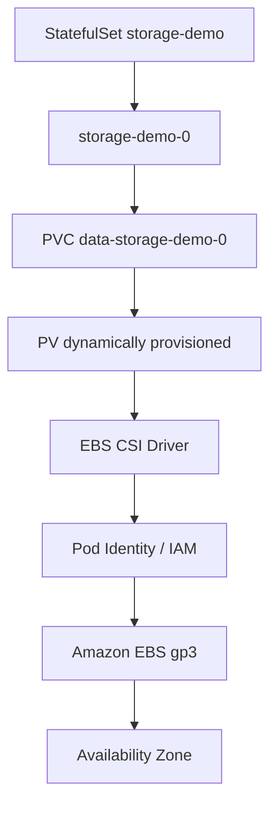
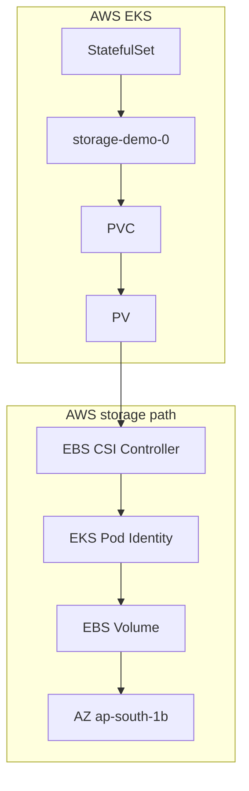
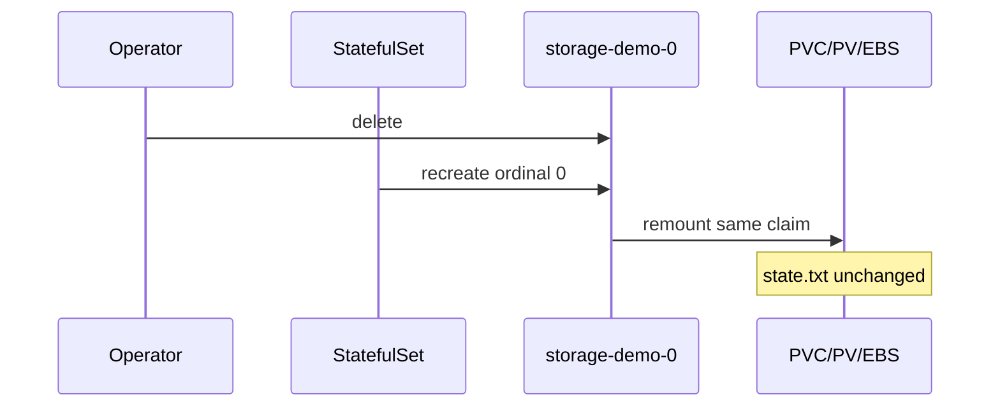

# AWS EKS Persistent Storage with EBS CSI

**Date:** 2026-09-26  
**Environment:** AWS EKS (`platform-lab-aws` / `platform-lab-aws-lab-eks`) · region `ap-south-1`  
**Scope:** Isolated `storage-lab` StatefulSet + Amazon EBS CSI (not `platform-lab`, not VMware)  
**Argo Application:** `platform-storage-aws` · revision `bd5e6dc`

---

## 1. Objective

Prove the AWS storage chain:

```text
EKS → Amazon EBS CSI Driver → StorageClass → PVC → PV → StatefulSet → Pod
```

Then validate **Pod deletion recovery** (same AZ):

```text
Pod deleted → StatefulSet recreates storage-demo-0 → same PVC/PV/EBS → state.txt survives
```

This milestone does **not** test worker-node failure or cross-AZ mobility.

---

## 2. Kubernetes Storage Abstraction

| Object | Responsibility |
|---|---|
| **StorageClass** | How storage is provisioned (`ebs.csi.aws.com`, gp3, binding mode) |
| **PersistentVolume (PV)** | Provisioned EBS volume as a Kubernetes object |
| **PersistentVolumeClaim (PVC)** | Pod-facing request (size, access mode, class) |
| **Pod** | Mounts the claim at `/data` |

**Pod → PVC → PV is the Kubernetes abstraction.**  
**EBS volume is the AWS storage implementation.**



---

## 3. Why EBS CSI

The in-tree `kubernetes.io/aws-ebs` provisioner (legacy `gp2` StorageClass) is not the supported path for current EKS. AWS recommends the **Amazon EBS CSI Driver** as an **EKS managed add-on**, with **EKS Pod Identity** for IAM.

Precheck found:

| Item | Result |
|---|---|
| `ebs.csi.aws.com` CSIDriver | **Absent** before this lab |
| `ebs-csi-controller` / `ebs-csi-node` | **Absent** |
| Existing CSIDriver | `efs.csi.aws.com` only (stale CR; no EFS driver pods) |
| Default StorageClass | `gp2` (`kubernetes.io/aws-ebs`) — left untouched |

No duplicate EBS CSI installation was present; the managed add-on was safe to install.

---

## 4. AWS EBS CSI Add-on

| Field | Value |
|---|---|
| Add-on | `aws-ebs-csi-driver` |
| Version (pinned) | **`v1.66.0-eksbuild.1`** |
| Status | **ACTIVE** |
| Selected via | `aws eks describe-addon-versions --kubernetes-version 1.36` |
| Controller pods | **2** (`ebs-csi-controller`) |
| Node plugin pods | **2** (`ebs-csi-node` DaemonSet on both workers) |
| CSIDriver | `ebs.csi.aws.com` |

Terraform module: `terraform/aws/modules/ebs_csi`.

---

## 5. IAM / Pod Identity

| Field | Value |
|---|---|
| IAM role | `platform-lab-aws-lab-ebs-csi` |
| Trust | EKS Pod Identity assume-role document (existing IAM module pattern) |
| Policy | **`AmazonEBSCSIDriverPolicy`** (`arn:aws:iam::aws:policy/service-role/AmazonEBSCSIDriverPolicy`) |
| Association ID | `a-23naus0dyzl5ii5ks` |
| Namespace / SA | `kube-system` / `ebs-csi-controller-sa` |

**Why this policy:** `AmazonEBSCSIDriverPolicyV2` is not published in this account/region. `describe-addon-configuration` and current AWS docs point at the managed `service-role/AmazonEBSCSIDriverPolicy` for dynamic EBS provisioning. Dedicated role — not the node role, Jenkins, or ALB controller role.

---

## 6. StorageClass

| Field | Value |
|---|---|
| Name | **`ebs-gp3`** |
| Provisioner | `ebs.csi.aws.com` |
| Parameters | `type=gp3`, `fsType=ext4` |
| volumeBindingMode | **`WaitForFirstConsumer`** |
| reclaimPolicy | **`Delete`** |
| Cluster default? | **No** — existing `gp2` default unchanged |

`WaitForFirstConsumer` delays volume creation until the Pod is scheduled so the AZ topology of the chosen node can drive EBS placement (EBS is AZ-scoped).

Git: `kubernetes/storage-lab-aws/storageclass.yaml`.

---

## 7. StatefulSet

| Field | Value |
|---|---|
| Name | `storage-demo` |
| Namespace | `storage-lab` |
| Replicas | 1 |
| Image | `nginx:1.27-alpine` |
| Mount | `/data` via `volumeClaimTemplates` |
| Resources | requests `25m`/`32Mi`, limits `100m`/`64Mi` |

On first start the container writes `/data/state.txt` only if missing (so recreation preserves content).

---

## 8. PVC

| Field | Observed |
|---|---|
| Name | `data-storage-demo-0` |
| UID | `612d84fb-dbd4-46d9-a17f-735216f0594d` |
| Size | **1Gi** |
| Access mode | ReadWriteOnce |
| StorageClass | `ebs-gp3` |
| Status | **Bound** |

---

## 9. PV

| Field | Observed |
|---|---|
| Name | `pvc-612d84fb-dbd4-46d9-a17f-735216f0594d` |
| Capacity | 1Gi |
| Driver | `ebs.csi.aws.com` |
| volumeHandle | `vol-05faa26874d720ecd` |
| Reclaim | Delete |
| Status | **Bound** |

---

## 10. EBS Volume

| Field | Observed (EC2 API) |
|---|---|
| Volume ID | `vol-05faa26874d720ecd` |
| Type | **gp3** |
| Size | **1 GiB** |
| AZ | **`ap-south-1b`** |
| State | `in-use` (attached) |
| Created by | EBS CSI (not Terraform, not manual) |

---

## 11. Architecture




**PVC/PV survive Pod recreation** (proven below). Node-failure resilience is **not** claimed.

---

## 12. GitOps

| Resource | Path |
|---|---|
| AppProject | `gitops/projects/platform-storage-aws.yaml` |
| Application | `gitops/applications/platform-storage-aws.yaml` |
| Manifests | `kubernetes/storage-lab-aws/` |
| Sync | automated · prune · selfHeal · CreateNamespace |

```text
Git (main) → Argo CD platform-storage-aws → storage-lab + StorageClass ebs-gp3
```

Isolated from `platform-lab-aws`.

---

## 13. Initial State

| Item | Value |
|---|---|
| Pod | `storage-demo-0` Running 1/1 |
| Node | `ip-10-50-52-64.ap-south-1.compute.internal` |
| Pod UID | `c9bf64e4-d373-49eb-a925-d2853812cff4` |
| PVC / PV / EBS | as above |

`state.txt` before failure:

```text
AWS EBS persistence test
Pod: storage-demo-0
Node: ip-10-50-52-64.ap-south-1.compute.internal
Created: 2026-09-26T08:39:04Z
Test-ID: aws-ebs-storage-lab-001
```

---

## 14. Pod Failure Experiment

```bash
kubectl delete pod storage-demo-0 -n storage-lab
```

| Observation | Result |
|---|---|
| Recreate time to Ready | **~14 seconds** |
| Ordinal name | `storage-demo-0` (unchanged) |
| New Pod UID | `095aadb0-452c-44fe-9730-401b32e3b6cf` |
| Node after | same worker (`ip-10-50-52-64…`) |
| PVC / PV / EBS | **unchanged** |

PVC, PV, StatefulSet, StorageClass, and EBS volume were **not** deleted.




---

## 15. EBS Reattachment

Observed after recreation:

- Scheduler assigned `storage-demo-0` again to the same node in `ap-south-1b`.
- Pod events showed Schedule → Pull (image present) → Created → Started.
- PVC remained Bound to the same PV / `vol-05faa26874d720ecd`.
- Volume stayed `in-use` in EC2 (CSI owns attach/detach; no manual EC2 operations).

Exact attach event wording can vary; identity of PVC/PV/volumeHandle is the durable proof.

---

## 16. Data Persistence

| | Contents |
|---|---|
| **Before** | identical `state.txt` (Created `2026-09-26T08:39:04Z`, Test-ID `aws-ebs-storage-lab-001`) |
| **After** | **identical** — file was not rewritten |

Pod identity changed (new UID); storage identity did not.

---

## 17. Node / AZ Topology

PV `nodeAffinity` (observed):

```yaml
nodeAffinity:
  required:
    nodeSelectorTerms:
      - matchExpressions:
          - key: topology.kubernetes.io/zone
            operator: In
            values:
              - ap-south-1b
```

Scheduling + PV topology + EBS AZ must agree. This lab kept the Pod on a worker in `ap-south-1b`. Cross-AZ scheduling is **not** automatic shared storage.

---

## 18. Observability

### Prometheus / KSM (verified)

| Metric | Observed |
|---|---|
| `kube_statefulset_replicas{…storage-demo}` | **1** |
| `kube_statefulset_status_replicas_ready` | **1** |
| `kube_pod_status_ready{…storage-demo-0}` | **1** |
| `kube_pod_status_phase{phase="Running"}` | **1** |
| `kube_persistentvolumeclaim_status_phase{phase="Bound"}` | **1** (after enabling PVC/PV collectors) |
| `kube_persistentvolume_status_phase{phase="Bound"}` | **1** (join with `kube_persistentvolume_info{storageclass="ebs-gp3"}`) |
| `kube_pod_info{…}` | node = `ip-10-50-52-64…` |
| `kube_pod_spec_volumes_persistentvolumeclaims_info` | PVC `data-storage-demo-0` mounted |

PVC/PV phase series require KSM collectors `persistentvolumeclaims` / `persistentvolumes` (enabled for this lab). File contents are **not** visible in Prometheus — validated with `kubectl exec`.

EBS attach state and volume type/size are verified via **EC2 `describe-volumes`**, not Prometheus.

### Grafana

| Field | Value |
|---|---|
| Title | Kubernetes Storage AWS |
| UID | `kubernetes-storage-aws` |
| Git | `observability/aws/dashboards/kubernetes-storage-aws-dashboard.yaml` |

---

## 19. VMware vs AWS Comparison


| Aspect | VMware (`local-path`) | AWS (`ebs-gp3`) |
|---|---|---|
| Provisioning | local-path provisioner | EBS CSI dynamic |
| Backend | node-local hostPath | Amazon EBS gp3 |
| Access mode | RWO | RWO |
| Topology | hostname `nodeAffinity` | zone `topology.kubernetes.io/zone` |
| Pod delete | data survives (same node) | data survives (CSI remounts EBS) |
| Node failure | **not portable** (node-local) | same-AZ attach possible — **not tested here** |
| Lifecycle owner | local-path + node disk | EBS CSI + EC2 volume |
| K8s abstraction | Pod → PVC → PV | Pod → PVC → PV (**shared**) |

**Do not treat the backends as equally resilient.**

---

## 20. EBS Limitations

- EBS volumes are **Availability Zone scoped**.
- Same-node / same-AZ Pod restart: volume can remount (proven).
- Reschedule to another node: only if that node is in the **same AZ** and the volume can attach.
- Cross-AZ failover ≠ multi-AZ shared filesystem.
- No manual detach/attach was performed in this lab.

---

## 21. Cost Considerations

Introduced resources (observed, not priced estimates):

- **1 GiB gp3** EBS volume (`vol-05faa26874d720ecd`)
- EBS CSI EKS add-on (controller + node plugins)
- Dedicated IAM role + Pod Identity association

No total monthly project cost is claimed from memory.

---

## 22. Lessons Learned

1. Prefer the EKS managed EBS CSI add-on + Pod Identity over Helm self-management when the agent is already present.  
2. Pin the add-on version from `describe-addon-versions` for the cluster Kubernetes version.  
3. `WaitForFirstConsumer` + zone topology matter because EBS is AZ-local.  
4. StatefulSet ordinal + PVC identity survive Pod deletion; Pod UID does not.  
5. Prometheus proves object health; `kubectl exec` + EC2 API prove data and volume facts.  
6. Full Terraform plans may show unrelated SG drift — target EBS IAM/add-on resources when isolating storage work.

---

## 23. Future Node-Failure Experiment

**Not performed in this milestone.**

```text
EBS-backed StatefulSet
  → node hosting Pod becomes unavailable
  → Kubernetes reschedules Pod if allowed
  → EBS must attach to a surviving node in the same AZ
  → data remains (hypothesis — untested)
```

Possible failure cases to test later:

- Same-AZ worker failure with a peer node in-AZ  
- No suitable node in the volume’s AZ  
- AZ failure  
- EBS volume / attach errors  

Do not claim recovery until that experiment is run.

---

## Related

- VMware storage lab: [`docs/vmware-storage-statefulset.md`](./vmware-storage-statefulset.md)  
- Architecture overview: [`docs/architecture/architecture-overview.md`](./architecture/architecture-overview.md)
