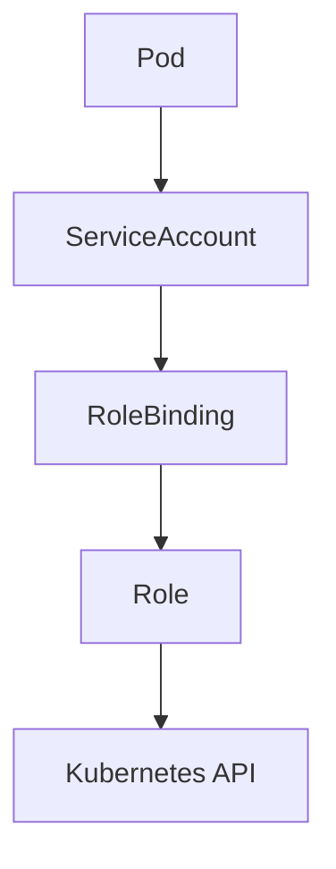
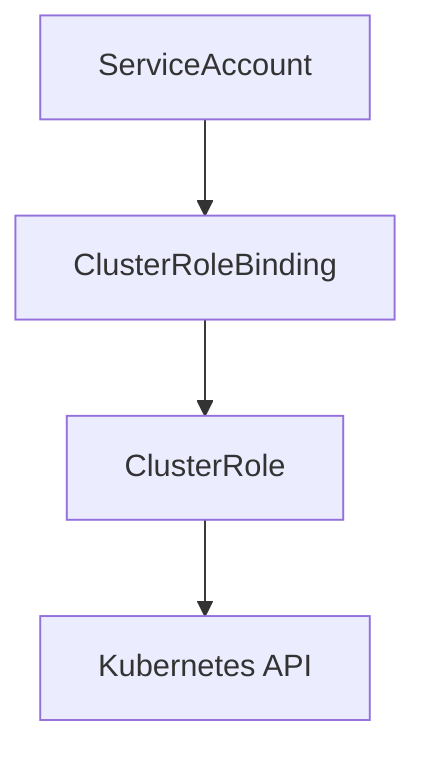
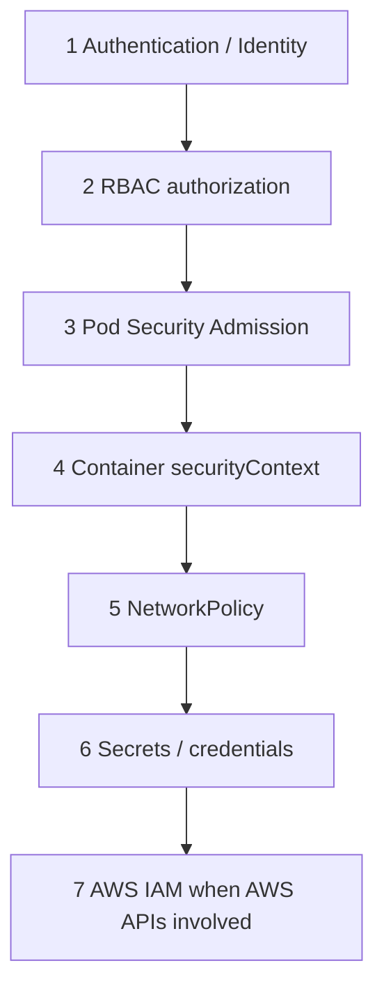

# Kubernetes Security & RBAC Hardening

**Date:** 2026-09-26  
**Milestone:** Project 1 — Section 22  
**Environments:** VMware `ckad-lab` (Kubernetes **1.31.14**) · AWS EKS `platform-lab-aws` (Kubernetes **1.36.4**)  
**GitOps apps:** `platform-security-vmware` · `platform-security-aws`  
**Feature commits:** `85d76a6` (+ follow-up fixes)

---

## 1. Security Objectives

Demonstrate, with **observed** results:

- Kubernetes identities and ServiceAccounts  
- Role / RoleBinding vs ClusterRole / ClusterRoleBinding  
- least privilege via `kubectl auth can-i`  
- ServiceAccount token mounting  
- Pod Security Admission (baseline enforce)  
- NetworkPolicy isolation (where the CNI enforces it)  
- safe workload hardening for `platform-lab`  
- AWS IAM vs Kubernetes RBAC boundary  

Isolated lab first (`security-lab`). Production-like stacks were not given elevated permissions.

---

## 2. Authentication vs Authorization

| Concept | Question |
|---|---|
| **Authentication** | Who are you? |
| **Authorization** | What are you allowed to do? |

A ServiceAccount answers identity. RBAC answers permissions. They are not the same.

---

## 3. Kubernetes Identities

Workload identity defaults to the namespace `default` ServiceAccount unless `serviceAccountName` is set. Users/admins authenticate separately (kubeconfig / OIDC). This lab focuses on **ServiceAccount** identities.

---

## 4. ServiceAccounts

Created in `security-lab`:

| SA | Purpose |
|---|---|
| `security-reader` | namespace pod read |
| `security-writer` | namespace pod create/delete |
| `security-node-reader` | cluster node read |
| `security-global-reader` | cluster-wide pod read |

Application change: dedicated `platform-lab` SA with `automountServiceAccountToken: false` (app does not call the Kubernetes API).

---

## 5. RBAC Model

---

## 6. Role

Namespaced permission set. Examples:

- `security-pod-reader` — pods get/list/watch  
- `security-pod-manager` — pods get/list/watch/create/delete (no update/patch)

---

## 7. RoleBinding

Binds a subject to a Role **or** ClusterRole **in one namespace**.

Critical observation: RoleBinding to ClusterRole `security-pod-viewer` still only grants access **inside `security-lab`**.

---

## 8. ClusterRole

Reusable permission set. Examples:

- `security-node-reader` — nodes get/list/watch  
- `security-pod-viewer` — pods get/list/watch (used via RoleBinding)  
- `security-global-pod-reader-role` — pods get/list/watch (used via ClusterRoleBinding)

---

## 9. ClusterRoleBinding

Grants a ClusterRole **across the cluster**. Example: `security-global-reader` can `get pods` in both `security-lab` and `platform-lab`.

---

## 10. Least Privilege

No `cluster-admin`, no `*` wildcards, no Secret verbs on lab SAs. Writer cannot modify RBAC. Reader cannot mutate Pods.

---

## 11. kubectl auth can-i

Primary verification tool. Results below are **actual** outputs from both clusters (identical RBAC outcomes).

---

## 12. ServiceAccount Token Exposure

| Workload | `automountServiceAccountToken` | Observed |
|---|---|---|
| `security-reader-demo` | `true` | `/var/run/secrets/kubernetes.io/serviceaccount` present (`token`, `ca.crt`, `namespace`) |
| `security-no-api` | `false` | path **absent** |

Identity can exist without automatically exposing an API token inside the container.

---

## 13. Pod Security Admission

Namespace labels on `security-lab`:

| Env | enforce | audit/warn | version |
|---|---|---|---|
| VMware | baseline | restricted | **v1.31** |
| AWS | baseline | restricted | **v1.36** |

---

## 14. Baseline vs Restricted

Baseline rejects privileged / host namespaces / hostPath. Restricted additionally warns/rejects missing `runAsNonRoot`, capability drops, seccomp, etc.

Root-user Pod: **allowed under baseline** with **restricted warnings** (both clusters).

---

## 15. Security Context

### platform-lab before

Already had (base Deployment):

- `runAsNonRoot: true`, UID/GID `10001`  
- `allowPrivilegeEscalation: false`  
- `capabilities.drop: [ALL]`  
- `seccompProfile: RuntimeDefault`  
- Default SA (implicit), token automount default **true**

Dockerfile: `USER app` (UID 10001).

### platform-lab after

- Dedicated SA `platform-lab`  
- `automountServiceAccountToken: false`  
- Existing securityContext **unchanged**  

**Not implemented:** `readOnlyRootFilesystem: true` (FastAPI/uvicorn may need writable paths; not tested).

---

## 16. NetworkPolicy

`security-lab` policies:

1. `default-deny-ingress`  
2. `allow-net-client-to-server` (only `security-net-client-allowed` → server `:8080`)

| Env | Allowed client | Denied client |
|---|---|---|
| **VMware (Calico)** | `OK` | **timeout** (blocked) |
| **AWS** | `OK` | `OK` (NetworkPolicy **not enforced** by current VPC CNI setup) |

AWS finding is intentional documentation: NetworkPolicy objects exist, but without a policy-capable CNI dataplane they do not isolate.

Existing `platform-lab` NetworkPolicies were **not** replaced.

---

## 17. Secrets

- `platform-lab` / `security-lab`: **no application Secrets** present (names inventory only; values never printed).  
- Lab SAs: **`get secrets` = no** for reader, writer, node-reader, global-reader.  
- Secret read remains a highly sensitive permission and was not granted.

---

## 18. Argo CD Security Review

**Read-only.** Applications remain project-scoped (`platform-lab`, `platform-storage-*`, `platform-security-*`, observability). Global Argo controller RBAC was **not** modified. Future: review AppProject wildcards and controller ClusterRoles.

---

## 19. Jenkins Security Review

**Read-only.** Jenkins performs CI / Docker / GitOps promotion — not cluster deploy. Architecture and credentials were **not** changed. Future: ensure no kubectl `cluster-admin` on CI agents.

---

## 20. AWS IAM vs Kubernetes RBAC

| Control plane | Controls |
|---|---|
| Kubernetes RBAC | kube-apiserver verbs |
| AWS IAM | AWS APIs |

EBS CSI chain (unchanged): Pod → SA → Pod Identity → IAM Role → EBS APIs.

---

## 21. VMware vs AWS Security Considerations

| Topic | VMware | AWS |
|---|---|---|
| Kubernetes | 1.31.14 | 1.36.4 |
| PSA version labels | v1.31 | v1.36 |
| NetworkPolicy enforcement | Calico — **works** | VPC CNI — **objects only** (no deny observed) |
| Existing PSA labels | calico/metallb privileged; app NS unlabeled | app NS unlabeled |

---

## 22. Security Test Matrix

Observed on **both** clusters unless noted:

| Identity | Namespace | Resource | Verb | Expected | Observed |
|---|---|---|---|---|---|
| security-reader | security-lab | pods | get/list/watch | yes | **yes** |
| security-reader | security-lab | pods | create/delete | no | **no** |
| security-reader | security-lab | secrets | get | no | **no** |
| security-reader | platform-lab | pods | get | no | **no** |
| security-reader | security-lab | roles/rolebindings | get/create | no | **no** |
| security-writer | security-lab | pods | create/delete | yes | **yes** |
| security-writer | security-lab | pods | update/patch | no | **no** |
| security-writer | security-lab | secrets | get | no | **no** |
| security-writer | security-lab | roles | create | no | **no** |
| security-node-reader | cluster | nodes | get/list | yes | **yes** |
| security-node-reader | security-lab | pods | get | no | **no** |
| security-global-reader | security-lab + platform-lab | pods | get | yes | **yes** |
| security-global-reader | any | secrets | get | no | **no** |
| security-global-reader | cluster | nodes | get | no | **no** |

---

## 23. Findings

1. ServiceAccount ≠ permission until bound.  
2. RoleBinding scopes even ClusterRole refs to one namespace.  
3. ClusterRoleBinding expands pod read across namespaces without granting Secrets/nodes.  
4. Token automount is independent of SA identity.  
5. PSA baseline blocks privileged/hostPath/hostNetwork/hostPID; root still allowed with restricted warnings.  
6. NetworkPolicy effectiveness depends on CNI (Calico yes / current EKS VPC CNI no).  
7. `platform-lab` did not need Kubernetes API access — disabling token mount is appropriate.

---

## 24. Changes Implemented

- GitOps `kubernetes/security-lab-vmware` + `kubernetes/security-lab-aws`  
- Argo apps/projects `platform-security-vmware` / `platform-security-aws`  
- Dedicated `platform-lab` ServiceAccount + `automountServiceAccountToken: false`  
- AppProject whitelist for ServiceAccount on platform-lab projects  

---

## 25. Changes Deliberately Not Implemented

- No Argo/Jenkins/kube-system RBAC changes  
- No EBS CSI IAM changes  
- No `readOnlyRootFilesystem` on the app  
- No Secret permissions for lab SAs  
- No cluster-admin demos  
- No AWS NetworkPolicy CNI install in this milestone  

---

## 26. Future Hardening

- Enable AWS Network Policy agent / Cilium / Calico for EKS dataplane enforcement  
- Consider `restricted` enforce on `security-lab` after workloads fully comply  
- Review Argo controller ClusterRoles and AppProject defaults  
- Confirm CI agents never receive broad kubectl credentials  

---

## Security layers diagram

## Related paths

- Manifests: `kubernetes/security-lab-vmware/`, `kubernetes/security-lab-aws/`  
- App hardening: `kubernetes/base/serviceaccount.yaml`, `deployment.yaml`  
- Argo: `gitops/applications/platform-security-*.yaml`
