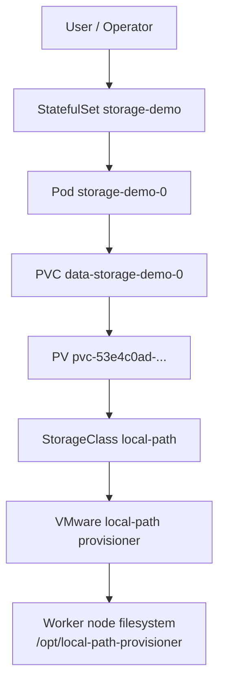
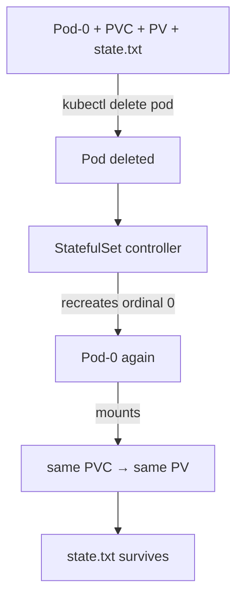

# VMware Kubernetes Persistent Storage and StatefulSet

**Date:** 2026-09-26  
**Environment:** VMware / on-prem kubeadm (`ckad-lab`)  
**Scope:** Isolated `storage-lab` StatefulSet + `local-path` persistence (not platform-lab, not AWS)  
**Argo Application:** `platform-storage-vmware` · revision `f33876d`

---

## 1. Objective

Prove the Kubernetes storage chain on VMware:

```text
StorageClass → PVC → PV → Pod / StatefulSet → persistent data
```

Then validate **Pod deletion recovery**:

```text
Pod deleted → StatefulSet recreates same ordinal → same PVC/PV → data survives
```

This is a storage learning lab — not a database, Ceph, or CSI install project.

---

## 2. Kubernetes Storage Mental Model

| Object | Responsibility |
|---|---|
| **StorageClass** | Describes *how* storage is provisioned (provisioner, binding mode, reclaim) |
| **PersistentVolume (PV)** | Represents *actual* provisioned storage (capacity, path, node affinity) |
| **PersistentVolumeClaim (PVC)** | Pod-facing *request* for storage (size, access mode, class) |
| **Pod** | *Consumes* a PVC via a volume mount |

Do not blur these: the Pod never “owns” the disk; it mounts a claim that binds to a volume provisioned by a class.

```text
StorageClass
    ↓  dynamic provisioning (on bind)
PersistentVolume
    ↓  bind
PersistentVolumeClaim
    ↓  mount
Pod
```

---

## 3. StorageClass

Observed default class (unchanged — not modified):

| Field | Value |
|---|---|
| Name | `local-path` (default) |
| Provisioner | `rancher.io/local-path` |
| reclaimPolicy | `Delete` |
| volumeBindingMode | `WaitForFirstConsumer` |
| allowVolumeExpansion | `false` |

`WaitForFirstConsumer` delays PV creation until a Pod is scheduled, so the volume can be created on the correct node.

---

## 4. PersistentVolume

Dynamically created for this lab:

| Field | Value |
|---|---|
| Name | `pvc-53e4c0ad-58c3-4633-8b52-a74ffe4998ed` |
| Capacity | **1Gi** |
| Access modes | `ReadWriteOnce` |
| Reclaim | `Delete` |
| Backend | `hostPath` under `/opt/local-path-provisioner/...` |
| Status | Bound |

---

## 5. PersistentVolumeClaim

Created by StatefulSet `volumeClaimTemplates`:

| Field | Value |
|---|---|
| Name | `data-storage-demo-0` |
| Namespace | `storage-lab` |
| Request | **1Gi** |
| Access mode | `ReadWriteOnce` |
| StorageClass | `local-path` |
| Bound volume | `pvc-53e4c0ad-58c3-4633-8b52-a74ffe4998ed` |
| Status | Bound |

Naming pattern: `<volumeClaimTemplate.name>-<statefulset.name>-<ordinal>` → `data-storage-demo-0`.

---

## 6. StatefulSet

| Field | Value |
|---|---|
| Name | `storage-demo` |
| Replicas | 1 |
| Stable Pod identity | `storage-demo-0` |
| Service | `storage-demo` (ClusterIP) |
| Image | `nginx:1.27-alpine` |
| Mount | PVC `data` → `/data` |
| Resources | requests 25m/32Mi · limits 100m/64Mi |

On first start the container writes `/data/state.txt` **only if missing**, so Pod recreation preserves the original file.

---

## 7. Architecture

### Mermaid — normal path



### SVG — architecture


### Mermaid — Pod failure recovery



### SVG — recovery


---

## 8. VMware local-path Storage

Provisioner Deployment: `local-path-storage/local-path-provisioner` (`rancher/local-path-provisioner:v0.0.30`).

ConfigMap `local-path-config`:

```json
{
  "nodePathMap": [
    {
      "node": "DEFAULT_PATH_FOR_NON_LISTED_NODES",
      "paths": ["/opt/local-path-provisioner"]
    }
  ]
}
```

Behavior:

- Dynamic PV via hostPath on the **scheduled** worker
- Required **nodeAffinity** on `kubernetes.io/hostname`
- Storage is **node-local**

> **LOCAL-PATH STORAGE IS NODE-LOCAL**  
> Pod restart / recreate on the same node → data persists.  
> Entire node failure → availability depends on that node’s disk; this milestone does **not** claim node-failure persistence.

---

## 9. Deployment Through GitOps

| Object | Path |
|---|---|
| Manifests | `kubernetes/storage-lab/` |
| AppProject | `gitops/projects/platform-storage-vmware.yaml` |
| Application | `gitops/applications/platform-storage-vmware.yaml` |
| Sync | automated · prune · selfHeal · CreateNamespace |

Bootstrap (Application CR only — workload comes from Git sync):

```powershell
kubectl --context=ckad-lab apply -f gitops/projects/platform-storage-vmware.yaml
kubectl --context=ckad-lab apply -f gitops/applications/platform-storage-vmware.yaml
```

Result: **Synced / Healthy**.

---

## 10. Initial State

| Resource | State |
|---|---|
| StatefulSet | `1/1` |
| Pod | `storage-demo-0` Running Ready on **k8s-worker-02** |
| PVC | Bound |
| PV | Bound |
| Service | ClusterIP `10.103.240.236:80` |

---

## 11. Data Persistence Test

Created on PVC mount `/data/state.txt`:

```text
Storage persistence test
Test-ID: vmware-storage-lab-001
Pod: storage-demo-0
Namespace: storage-lab
Node: k8s-worker-02
Created: 2026-09-26T08:03:43Z
```

Verified with `kubectl exec` (not ConfigMap / emptyDir).

---

## 12. Pod Failure Test

```powershell
kubectl delete pod storage-demo-0 -n storage-lab
```

Did **not** delete PVC, PV, or StatefulSet.

| Event | Observation |
|---|---|
| Delete | Pod UID `24a5d420-…` removed |
| Recreate | New Pod UID `d1ef3c5b-…` |
| Identity | Still **`storage-demo-0`** |
| Ready time | **~5 seconds** |

---

## 13. PVC/PV Survival

After recreation:

| Object | Same? |
|---|---|
| PVC `data-storage-demo-0` | **Yes** |
| PV `pvc-53e4c0ad-58c3-4633-8b52-a74ffe4998ed` | **Yes** |
| StatefulSet `storage-demo` | **Yes** |

---

## 14. Data Survival

`kubectl exec … -- cat /data/state.txt` after recreate returned **identical** content including the original `Created: 2026-09-26T08:03:43Z` timestamp.

**Confirmation: data survived Pod deletion.**

---

## 15. Pod Identity

| Controller | Pod naming | Storage relationship |
|---|---|---|
| Deployment | Generated hash suffix | Typically ephemeral / shared templates |
| StatefulSet | Stable ordinal (`-0`, `-1`, …) | `volumeClaimTemplates` → stable PVC per ordinal |

This experiment: deleted Pod returned as **`storage-demo-0`**, not a new random name.

---

## 16. Node Affinity

| | Value |
|---|---|
| Pod node before | `k8s-worker-02` |
| Pod node after | `k8s-worker-02` |
| PV nodeAffinity | required `kubernetes.io/hostname In [k8s-worker-02]` |
| hostPath | `/opt/local-path-provisioner/pvc-53e4c0ad-58c3-4633-8b52-a74ffe4998ed_storage-lab_data-storage-demo-0` |

Recreate stayed on the same worker because the PV **requires** that hostname.

---

## 17. Local-Path Limitations

If the backing node (`k8s-worker-02`) disappears:

- The PV still exists in the API with required affinity to that hostname
- A replacement Pod **cannot** mount the volume on another node while that affinity stands
- Data lives on that node’s local disk under `/opt/local-path-provisioner/...`

This milestone **inspected** affinity only — no kubelet stop / node power-off.

---

## 18. Prometheus/KSM Observation

Verified live series (existing VMware stack — no new exporters):

| Metric | Observed |
|---|---|
| `kube_statefulset_replicas{…storage-demo}` | **1** |
| `kube_statefulset_status_replicas_ready{…}` | **1** |
| `kube_pod_info{pod="storage-demo-0"}` | node=`k8s-worker-02` |
| `kube_pod_status_phase{phase="Running"}` | **1** |
| `kube_pod_status_ready{condition="true"}` | **1** |
| `kube_persistentvolumeclaim_info{…}` | storageclass=`local-path`, volumename bound |
| `kube_persistentvolumeclaim_status_phase{phase="Bound"}` | **1** |
| `kube_persistentvolume_status_phase{phase="Bound"}` | **1** |

Prometheus tells us **resource state**, not file contents. File persistence was validated with `kubectl exec`.

---

## 19. Grafana

| Field | Value |
|---|---|
| Title | Kubernetes Storage VMware |
| UID | `kubernetes-storage-vmware` |
| Git | `observability/dashboards/kubernetes-storage-vmware-dashboard.yaml` |
| Provisioning | ConfigMap label `grafana_dashboard: "1"` via `platform-lab-observability` |

Panels: StatefulSet desired/ready, Pod ready, PVC Bound, Pod phase, ready replicas timeseries, Pod info table.

---

## 20. Pod Storage vs Node Storage

| Layer | What it is |
|---|---|
| Pod volume mount `/data` | Consumes PVC |
| PVC/PV | Kubernetes API objects |
| hostPath directory | Bytes on **one worker’s** filesystem |

Deleting the Pod removes the process, not the hostPath directory (while PVC/PV remain Bound).

---

## 21. Failure Scenarios

| Scenario | Expected / observed |
|---|---|
| **A. Pod deleted** | Pod recreated · same PVC · **data survives** ✅ tested |
| **B. Pod scheduled on another node** | Depends on backend; local-path PV affinity **blocks** other nodes unless affinity/data move — **not tested** |
| **C. Backing node lost** | local-path data availability tied to that node — **not tested**; documented limitation only |

---

## 22. Lessons Learned

1. StatefulSet ordinal + `volumeClaimTemplates` give stable Pod/PVC identity.  
2. local-path dynamically provisions node-local hostPath with hostname affinity.  
3. Pod deletion is not data deletion when the PVC survives.  
4. Same Kubernetes PVC interface ≠ portable storage semantics.  
5. KSM/Grafana observe object health; content checks need `kubectl exec`.

---

## 23. AWS Storage Comparison

AWS EKS counterpart is implemented — see [`docs/aws-storage-statefulset.md`](./aws-storage-statefulset.md) and [`docs/diagrams/storage-vmware-vs-aws.svg`](./diagrams/storage-vmware-vs-aws.svg).


```text
VMware:  Pod → PVC → PV → local-path → node-local hostPath
AWS:     Pod → PVC → EBS CSI → EBS volume (AZ-scoped network block)
```

Same abstraction (`Pod`/`PVC`), different physical behavior (node-local vs attachable block). **VMware local-path remains node-local** — that finding is unchanged.

---

## 24. Future Storage Experiment

1. Controlled **node-level** storage failure on VMware (separate milestone).  
2. ~~AWS EBS node/AZ resilience~~ — **completed:** [`docs/aws-storage-resilience.md`](./aws-storage-resilience.md).  
3. Compare reclaim, attach/detach, and cross-node mobility with measured results across both labs.

`storage-lab` is retained for those lessons — PVC/PV are not cleaned up.
